# AutoGen 기반 AI Agent 개발 가이드


[TOC]


## 1. AI Agent 개요

- AI Agent는 환경을 인식하고, 목표를 달성하기 위해 자율적으로 행동하는 지능형 소프트웨어 시스템이다.

- 사용자의 명시적 지시 없이도 상황을 판단하고 적절한 행동을 선택할 수 있는 능력을 가지고 있다.


### 1.1 AI Agent 개념도

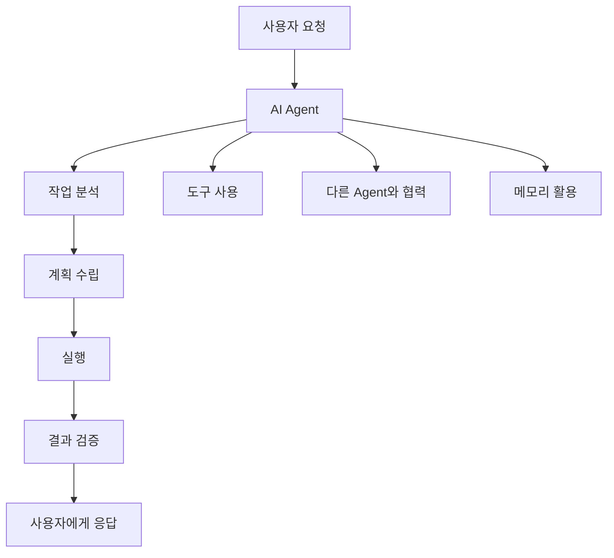

### 1.2 AI Agent의 특징

AI Agent는 단순한 챗봇을 넘어서 자율적으로 작업을 수행할 수 있는 지능형 시스템이다.

**주요 특징:**

- **자율성(Autonomy)**: 사용자의 지시 없이도 목표 달성을 위해 독립적으로 행동
- **반응성(Reactivity)**: 환경 변화에 즉각적으로 반응하고 적응
- **능동성(Proactivity)**: 목표 달성을 위해 선제적으로 행동
- **사회성(Social Ability)**: 다른 Agent나 사용자와 상호작용

**활용 분야:**
- 코드 생성 및 리뷰 자동화
- 데이터 분석 및 리포트 생성
- 고객 서비스 및 지원
- 프로젝트 관리 및 협업


### 1.3 AI Agent 프레임워크 종류

| 프레임워크          | 특징 및 주요 기능                                            | 장점                                                         | 단점                                                         |
| ------------------- | ------------------------------------------------------------ | ------------------------------------------------------------ | ------------------------------------------------------------ |
| **AutoGen**         | - LLM 기반 멀티에이전트 - 대화/함수호출/코드 실행/그룹챗 지원 - 오픈소스(Microsoft) | - 대화형 멀티에이전트 구성 용이 - 코드 실행, 기능 확장성 - Retrieval/RAG 지원 | - 복잡한 커스텀 시나리오엔 코드 깊이 이해 필요 - 비교적 많은 설정값 |
| **LangChain**       | - 체인 기반 워크플로 - 다양한 LLM/DB/도구와 연동 - RAG 특화 - 도구 플러그인 다양 | - 도구·DB·API 연동 쉬움 - 문서/코드 검색 강점 - 플러그인 생태계 풍부 | - 체인 구성에 대한 러닝커브 - 복잡한 파이프라인은 디버깅 난이도↑ |
| **CrewAI**          | - 멀티에이전트 태스크포스 - LLM 역할 기반 협업 - 각 에이전트 행동 명확 | - 협업 시나리오 설계 쉬움 - 분업 구조 구현에 적합 - 직관적 에이전트 관리 | - 복잡한 RAG/검색 기능 상대적 제한 - 대규모 확장성은 제한적  |
| **MetaGPT**         | - 멀티에이전트 코드 자동 생성(특히 소프트웨어 개발 시나리오) - 역할분담(기획, 설계, QA, 실행 등) | - 개발 자동화에 강점 - 실무 소프트웨어 개발 협업 시나리오 우수 - 결과물 일관성 | - 범용 AI Workflow엔 한계 - 유연한 비판리적 분업은 어려움    |
| **Haystack Agents** | - 강력한 RAG 및 검색 특화 - 멀티모달, PDF 등 문서 분석 도구 - 다양한 Backend 연동 지원 | - 문서/검색/RAG 챗봇에 최적 - 엔터프라이즈 환경 연동 쉬움    | - 대화형 멀티에이전트 한계 - LLM 대응력은 LangChain/AutoGen에 비해 약함 |


### 1.5. AI 관련 용어 

| 용어                                     | 정의                      | 예시                            | AutoGen에서의 역할  |
| ---------------------------------------- | ------------------------- | ------------------------------- | ------------------- |
| **LLM (Large Language Model)**           | 대규모 언어 모델          | GPT-4, Claude, Gemini           | Agent의 두뇌 역할   |
| **Prompt Engineering**                   | 효과적인 지시문 작성 기술 | "당신은 Python 전문가입니다..." | Agent 행동 정의     |
| **RAG (Retrieval-Augmented Generation)** | 외부 지식 검색 후 생성    | 문서 DB 검색 + 답변 생성        | 지식 확장 메커니즘  |
| **Function Calling**                     | 외부 함수/API 호출        | 파일 읽기, API 호출             | Tool 사용 능력      |
| **Multi-Agent System**                   | 여러 Agent 협력 시스템    | 개발자 + 테스터 + 리뷰어        | AutoGen의 핵심 개념 |
| **Conversation Flow**                    | 대화 흐름 제어            | 순차 → 병렬 → 조건부 실행       | Agent 간 상호작용   |

**LLM (Large Language Model)**

- 수십억 개의 매개변수를 가진 신경망 모델
- 자연어 이해와 생성 능력을 보유
- AutoGen에서 각 Agent의 추론 엔진 역할

**Prompt Engineering**

- Agent의 역할, 행동 방식, 출력 형식을 정의
- 시스템 프롬프트와 사용자 프롬프트로 구성
- 효과적인 프롬프트가 Agent 성능을 크게 좌우

**Multi-Agent System**

- 여러 전문화된 Agent가 협력하여 복잡한 작업 수행
- 각 Agent는 고유한 역할과 책임을 가짐
- 병렬 처리와 전문성 활용으로 효율성 증대


## 2. AutoGen 아키텍처 개요

### 2.1 AutoGen 이란?

Microsoft에서 개발한 AutoGen은 AI 에이전트를 구축하고 여러 에이전트 간의 협업을 통해 복잡한 작업을 해결할 수 있는 오픈소스 프로그래밍 프레임워크
사용자가 다양한 역할을 가진 에이전트들을 정의하고 이들 간의 상호작용을 설계함으로써 효율적인 AI 시스템을 구축할 수 있음.

| 항목               | AG (AutoGen, Microsoft)                                      | AG2 (AutoGen 2, 커뮤니티/창립자 주도)                        |
| :----------------- | :----------------------------------------------------------- | :----------------------------------------------------------- |
| **유래/운영 주체** | Microsoft가 주도, 공식 AutoGen 프로젝트                      | AutoGen 창립자 및 초기 기여자들이 독립적으로 운영            |
| **버전/아키텍처**  | 0.2.x 유지 + 0.4(완전 리라이트) 개발 중, 대대적 구조 변경 예정 | 0.3.x (0.2.34 기반, AG2로 리브랜딩), 기존 구조와 완전한 하위 호환성 |
| **주요 목표**  | MS 생태계 통합, TypeScript 등 다양한 언어 지원, 분산형 에이전트, Studio 개선, RAG/메모리 고도화 등 혁신적 기능 | 커뮤니티 중심, 안정성, 생산성, 실험/투명성, 기존 사용자 코드 보호, 모듈성·확장성 강화 |
| **패키지명**       | autogen, pyautogen (0.2.x/0.4.x)                             | ag2, autogen, pyautogen (동일, AG2가 메인)                   |
| **코드 호환성**    | 0.4에서 호환성 깨질 수 있음(완전 리라이트)                   | 기존 코드 100% 호환, 안정적 유지                             |
| **적합한 사용자**  | 최신 MS 생태계 활용, 혁신적 기능 원하는 사용자               | 안정성, 기존 코드 유지, 커뮤니티 중심 개발 선호자            |
| **공식 홈페이지**  | [공식 문서](https://microsoft.github.io/autogen/stable/index.html)[1](https://microsoft.github.io/autogen/stable/index.html), [MS Research](https://www.microsoft.com/en-us/research/project/autogen/)[5](https://www.microsoft.com/en-us/research/project/autogen/), [GitHub](https://github.com/microsoft/autogen)[3](https://www.linkedin.com/posts/harishnairlinked_github-microsoftautogen-a-programming-activity-7291068721555558400-_cOK) | [공식 문서](https://docs.ag2.ai/)[2](https://www.linkedin.com/posts/chi-wang-autogen_github-ag2aiag2-ag2-formerly-autogen-activity-7262922853312802818-WHp7), [GitHub](https://github.com/yaronbeen/ag2-1)[4](https://github.com/yaronbeen/ag2-1) |


### 2.2 AutoGen 아키텍처 

AutoGen은 기본적으로 **AssistantAgent**와 **UserProxyAgent** 두 가지 에이전트를 제공.

- AssistantAgent는 LLM에 의해 구동되어 코딩과 같은 작업을 수행
- UserProxyAgent는 코드 실행기(code executor)를 통해 코드 블록이 포함된 메시지를 받아 실행하고 결과를 반환.

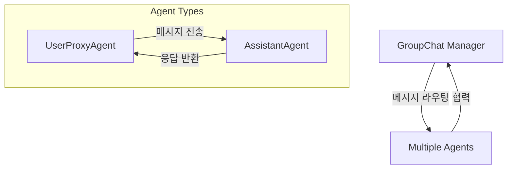

| 구성요소       | 역할               | 주요 기능                           |
| -------------- | ------------------ | ----------------------------------- |
| AssistantAgent | AI 어시스턴트      | LLM 기반 대화, 코드 생성, 문제 해결 |
| UserProxyAgent | 사용자 대리자      | 코드 실행, 사용자 입력 처리, 검증   |
| GroupChat      | 다중 에이전트 관리 | 여러 에이전트 간 협력, 대화 관리    |


### 3.3 AutoGen 시스템 구조도

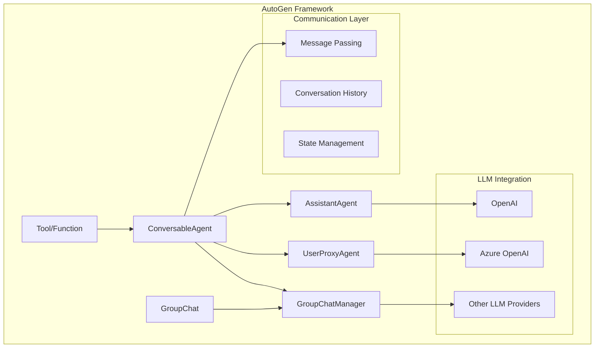

### 3.4 AutoGen Workflow

여러 AI 에이전트가 협력하여 특정 목표나 작업을 자동화·완수하는 일련의 절차와 구조를 의미함.
단일 에이전트가 아닌, 다양한 역할을 가진 에이전트들이 서로 소통하고, 작업을 분담하며, 단계적으로 문제를 해결하는 과정을 말함.

- **다중 에이전트 협업**
  여러 에이전트(예: 사용자 프록시, 보조 에이전트, 도구 에이전트 등)가 각자의 역할에 따라 정보를 주고받으며 공동의 목표를 달성.
  예를 들어, 사용자의 질문을 받아 분석하는 에이전트, 코드를 작성하는 에이전트, 실행 결과를 검증하는 에이전트가 순차적으로 협력.
- **대화 기반 제어 흐름**
  워크플로우는 에이전트 간 메시지 교환(대화)로 정의됩니다. 각 에이전트는 메시지를 받고, 응답을 생성하며, 필요에 따라 다른 에이전트에게 작업을 위임.
- **자동화와 반복 개선**
  워크플로우는 단순한 작업 분배를 넘어, 자동화된 코드 실행, 오류 감지 및 반복적 개선(자기 복구)까지 포함합니다. 예를 들어, 코드 실행 결과가 기대와 다를 경우 에이전트가 자동으로 수정·재실행을 시도.
- **유연한 구조**
  워크플로우는 일대일, 계층적, 그룹 대화 등 다양한 구조로 설계할 수 있습니다. 복잡한 문제는 여러 하위 작업으로 쪼개어 각 에이전트에 분배하고, 결과를 통합해 최종 목표를 달성.
- **도구·API 연동**
  에이전트는 외부 API, 데이터베이스, 코드 실행기 등 다양한 도구와 연동되어 워크플로우 내에서 실제 작업을 수행할 수 있음


## 3. Agent별 상세 기능

### 3.1 UserProxyAgent

#### UserProxyAgent 개요

UserProxyAgent는 사용자를 대신하여 코드를 실행하고, 다른 에이전트와의 상호작용을 관리하는 역할.

#### 주요 기능

- 코드 실행 환경 제공
- 사용자 입력 처리
- 파일 시스템 접근
- 외부 도구 실행

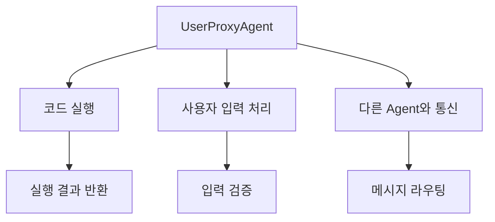

#### UserProxyAgent 상세 설정

##### 기본 파라미터 설명

| 파라미터 | 타입 | 설명 | 기본값 |
|---------|------|------|--------|
| `name` | str | 에이전트 이름 | "userproxy" |
| `human_input_mode` | str | 사용자 입력 모드 | "ALWAYS" |
| `code_execution_config` | dict | 코드 실행 설정 | None |
| `max_consecutive_auto_reply` | int | 최대 연속 자동 응답 수 | None |
| `is_termination_msg` | function | 종료 메시지 판단 함수 | None |

- human_input_mode

| 모드          | 인간 입력 요청 시점   | 자동 응답 여부                | 종료 조건 적용                  | 주요 사용 시나리오               |
| :------------ | :-------------------- | :---------------------------- | :------------------------------ | :------------------------------- |
| **NEVER**     | 절대 요청하지 않음    | 항상 자동 응답                | 종료 조건에 따라 자동 종료      | 완전 자율적 에이전트 시스템      |
| **TERMINATE** | 종료 조건 충족 시에만 | 일반적으로 자동, 종료 시 선택 | 인간이 개입하면 카운터 리셋     | 중요한 결정 시점에서만 인간 개입 |
| **ALWAYS**    | 매 턴마다 항상 요청   | 사용자가 skip 선택 시만 자동  | max_consecutive_auto_reply 무시 | 단계별 검토가 필요한 작업        |

##### 코드 실행 설정 파라미터

| 파라미터 | 타입 | 설명 |
|---------|------|------|
| `work_dir` | str | 작업 디렉토리 경로 |
| `use_docker` | bool | Docker 사용 여부 |
| `timeout` | int | 실행 타임아웃 (초) |
| `last_n_messages` | int | 저장할 최근 메시지 수 |

##### 대화 관련 메소드

| 메소드명             | 매개변수                                      | 반환값     | 설명                               |
| :------------------- | :-------------------------------------------- | :--------- | :--------------------------------- |
| **initiate_chat()**  | recipient, message, max_turns, summary_method | ChatResult | 다른 에이전트와 대화 시작          |
| **send()**           | message, recipient, request_reply             | bool       | 메시지 전송                        |
| **receive()**        | message, sender, request_reply                | None       | 메시지 수신 및 처리                |
| **generate_reply()** | messages, sender, exclude                     | str/None   | 응답 생성 (일반적으로 사용자 입력) |


##### UserProxyAgent 활용 실습

###### 코드 실행 전문 UserProxyAgent

```python
# 01.user_proxy.py
import os
from autogen import UserProxyAgent

# 코드 실행에 특화된 UserProxyAgent
user_proxy = UserProxyAgent(
    name="code_executor",
    system_message="""코드 실행 전문 에이전트입니다.
    안전하고 효율적인 코드 실행을 담당합니다.""",
    human_input_mode="NEVER",  # 사용자 입력 없이 자동 실행
    code_execution_config={
        "work_dir": "./",
        "use_docker": False,
        "timeout": 120,  # 더 긴 타임아웃
        "last_n_messages": 5,  # 더 많은 메시지 저장
    },
    # 커스텀 종료 조건
    is_termination_msg=lambda msg: "작업 완료" in msg.get("content", "") or
                                   "TERMINATE" in msg.get("content", "")
)

#Autogen Agent는 Markdown 코드펜스 문법을 인식하여 정의된 언어 기반으로 실행한다.
#기본은 Python 이며 Linux 환경일 경우 bash, Windows 환경일 경우 shell, 나머지 언어는 별도 커스텀 Executor가 필요하다.
messages = [{"role": "user", "content": "```shell\nls\n```"}]
print("messages", messages)

#실행 및 결과 확인
response = user_proxy.generate_reply(messages)
print(response)
```


### 3.2 AssistantAgent

#### AssistantAgent 개요

AssistantAgent는 대화형 AI 어시스턴트로, LLM을 기반으로 사용자의 질문에 답하고 코드를 생성하는 역할.

##### 주요 기능

- LLM 기반 추론 및 응답 생성
- 함수 호출 및 도구 사용 가능
- 컨텍스트 기반 대화 진행


#### AssistantAgent 상세 설정

##### 기본 파라미터 설명

| 파라미터 | 타입 | 설명 | 기본값 |
|---------|------|------|--------|
| `name` | str | 에이전트 이름 | "assistant" |
| `system_message` | str | 시스템 메시지 (역할 정의) | None |
| `llm_config` | dict | LLM 설정 정보 | None |
| `max_consecutive_auto_reply` | int | 최대 연속 자동 응답 수 | None |
| `human_input_mode` | str | 사용자 입력 모드 | "TERMINATE" |


#### AssistantAgent 활용 실습

##### 기본 AssistantAgent 생성

```python
import os
from autogen import AssistantAgent

# LLM 설정 구성
config_list_azure = [
    {
        "model": "gpt-4o",
        "api_key": "" # 실제 키 사용 시 주의,
        "base_url": "https://api.openai.com/v1",
    }
]
llm_config = {
    "cache_seed": 42, # 임의의 시드값
    "temperature": 0.7, # LLM 응답의 다양성 제어
    "config_list" : config_list_azure
} 

# AssistantAgent 생성
assistant = AssistantAgent(
    name="coding_assistant",  # 에이전트 이름
    system_message="""당신은 숙련된 Python 개발자입니다. 
    사용자의 코딩 질문에 명확하고 실용적인 답변을 제공하세요.
    코드 예제를 포함하여 설명해주세요.""",
    llm_config=llm_config,
    max_consecutive_auto_reply=3,  # 최대 3번까지 연속 응답
)

print("AssistantAgent가 성공적으로 생성되었습니다.")
```

##### 전문화된 AssistantAgent 생성

```python
# 코드 리뷰 전문 AssistantAgent
code_reviewer = AssistantAgent(
    name="code_reviewer",
    system_message="""당신은 코드 리뷰 전문가입니다.
    다음 관점에서 코드를 검토해주세요:
    1. 코드 품질 및 가독성
    2. 성능 최적화 가능성
    3. 보안상 문제점
    4. 베스트 프랙티스 준수 여부
    구체적인 개선 제안을 포함해주세요.""",
    llm_config=llm_config,
)

# 데이터베이스 전문 AssistantAgent
db_expert = AssistantAgent(
    name="database_expert",
    system_message="""당신은 데이터베이스 전문가입니다.
    SQL 쿼리 최적화, 데이터베이스 설계, 인덱싱 전략에 대해
    전문적인 조언을 제공합니다.
    Java/Python 환경에서의 데이터베이스 연동에 특화되어 있습니다.""",
    llm_config=llm_config,
)
```

##### 고급 설정을 포함한 AssistantAgent

```python
# 고급 설정이 적용된 AssistantAgent
advanced_assistant = AssistantAgent(
    name="advanced_coding_assistant",
    system_message="""당신은 KT의 백엔드 개발팀을 위한 AI 코딩 어시스턴트입니다.
    Java Spring Boot와 Python Django/FastAPI 프레임워크에 특화되어 있습니다.
    통신 서비스 도메인 지식을 바탕으로 실무적인 조언을 제공합니다.""",
    llm_config={
        **llm_config,
        "temperature": 0.3,  # 더 일관된 응답을 위해 낮은 temperature
        "top_p": 0.9,  # 응답 다양성 조절
        "frequency_penalty": 0.1,  # 반복 방지
    },
    max_consecutive_auto_reply=5,
    human_input_mode="NEVER",  # 사용자 개입 없이 자동 진행
)
```


###### AssistantAgent와 UserProxyAgent 연동 실습

```python
# 02.assistant_agent.py
import os
from autogen import AssistantAgent, UserProxyAgent

# LLM 설정 구성
config_list_azure = [
    {
        "model": "gpt-4o",
        "api_key": "" # 실제 키 사용 시 주의,
        "base_url": "https://api.openai.com/v1",
    }
]
llm_config = {
    "cache_seed": 42, # 임의의 시드값
    "temperature": 0.7, # LLM 응답의 다양성 제어
    "config_list" : config_list_azure
} 

# 코드 실행에 특화된 UserProxyAgent
user_proxy = UserProxyAgent(
    name="code_executor",
    system_message="""코드 실행 전문 에이전트입니다.
    안전하고 효율적인 코드 실행을 담당합니다.""",
    human_input_mode="ALWAYS",  # 사용자 입력 없이 자동 실행
    max_consecutive_auto_reply=15,
    code_execution_config={
        "work_dir": "./",
        "use_docker": False,
        "timeout": 120,  # 더 긴 타임아웃
        "last_n_messages": 5,  # 더 많은 메시지 저장
    },
    # 커스텀 종료 조건
    is_termination_msg=lambda msg: "작업 완료" in msg.get("content", "") or 
                                   "TERMINATE" in msg.get("content", "")
)

# AssistantAgent 생성
assistant = AssistantAgent(
    name="coding_assistant",  # 에이전트 이름
    system_message="""당신은 숙련된 Python 개발자입니다. 
    사용자의 코딩 질문에 명확하고 실용적인 답변을 제공하세요.
    코드 예제를 포함하여 설명해주세요.""",
    llm_config=llm_config,
    max_consecutive_auto_reply=3,  # 최대 3번까지 연속 응답
)

#실행 및 결과 확인
response = user_proxy.initiate_chat(
    assistant,
    message="""Python으로 간단한 계산기 클래스를 만들어주세요.
    다음 기능이 포함되어야 합니다:
    1. 사칙연산 (덧셈, 뺄셈, 곱셈, 나눗셈)
    2. 계산 이력 저장
    3. 이력 조회 기능
    
    코드를 작성한 후 간단한 테스트도 실행해주세요."""
)

print(response)
```


### 3.3 GroupChat

#### GroupChat 개요

GroupChat은 여러 에이전트들이 함께 참여하는 다중 에이전트 대화 시스템입니다. 복잡한 문제를 여러 전문가 에이전트들이 협력하여 해결.

#### 주요 기능

- 다중 에이전트 협업은  대화 스레드(GroupChat)와 다음 화자를 선택·브로드캐스트하는 관리 에이전트(GroupChatManager)가 있으며, 모든 참가자는 동일한 메시지 토픽/컨텍스트를 공유합니다.
  - “관리자 선택 → 선택된 에이전트 발화 → 관리자 브로드캐스트”의 반복으로 구성되고, 종료 조건을 만족하면 관리자가 대화를 중단합니다.
- GroupChat은 **에이전트 리스트, 메시지 기록, 발화자 선택 방법, 전이 제약 등**을 관리합니다.
  - 화자 선택 전략으로 round_robin, random, manual, auto(LLM 기반) 등을 지원하며, 용도에 따라 엄격한 순서 혹은 유연한 선택을 구성할 수 있습니다.

- GroupChatManager는 **GroupChat의 진행, 발화자 선택, LLM 활용, 종료 조건 관리** 등을 담당합니다.
  - 그룹 챗의 회전 규칙·종료 규칙·발화자 선택을 통합 관리하는 에이전트로 미리 정해진 최대 자동 응답 횟수나 종료 메시지 감지 등 제어 포인트를 제공합니다.


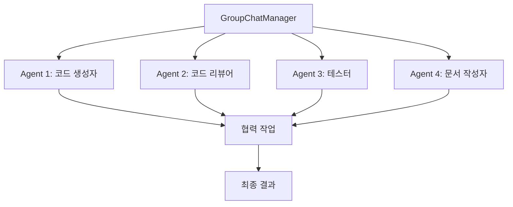

- RoundRobin vs Auto

| 항목      | RoundRobin                                                   | Auto(LLM)                                                  |
| :-------- | :----------------------------------------------------------- | :--------------------------------------------------------- |
| 화자 선정 | 에이전트 리스트 순서를 고정 순환하며 다음 화자를 선택합니다. | 컨텍스트를 바탕으로 LLM이 다음 화자를 동적으로 선택합니다. |
| 장점      | 예측 가능성과 공평성, 디버깅이 용이합니다.                   | 유연한 흐름 구성과 동적 역할 할당이 가능합니다.            |
| 단점      | 맥락 기반 우선순위 변경이 어렵습니다.                        | 모델 품질과 프롬프트 설계에 민감합니다.                    |
| 종료      | max_round, 수동 종료, 특정 키워드 등으로 종료합니다.         | 동일 종료 조건 + LLM 선택 실패 시 폴백 로직이 관여합니다.  |


#### GroupChat 상세 설정

##### GroupChat 파라미터 설명

| 파라미터 | 타입 | 설명 | 기본값 |
|---------|------|------|--------|
| `agents` | list | 참여할 에이전트 리스트 | [] |
| `messages` | list | 대화 메시지 리스트 | [] |
| `max_round` | int | 최대 대화 라운드 수 | 10 |
| speaker_selection_method | str | 발화자 선정 방식(round_robin, random, manual, auto(LLM 기반)) | "auto" |
| `admin_name` | str | 관리자 이름 | "Admin" |
| `func_call_filter` | bool | 함수 호출 필터링 | True |

##### GroupChatManager 파라미터 설명

| 파라미터 | 타입 | 설명 |
|---------|------|------|
| `groupchat` | GroupChat | 관리할 그룹챗 객체 |
| `name` | str | 매니저 이름 |
| `llm_config` | dict | LLM 설정 |


##### GroupChat 활용 실습

```python
# 03.group_chat.py
from autogen import GroupChat, GroupChatManager, AssistantAgent, UserProxyAgent

config_list_azure = [
    {
        "model": "gpt-4o",
        "api_key": "" # 실제 키 사용 시 주의,
        "base_url": "https://api.openai.com/v1",
    }
]
llm_config = {
    "cache_seed": 42, # 임의의 시드값
    "temperature": 0.7, # LLM 응답의 다양성 제어
    "config_list" : config_list_azure
}    

# 다양한 역할의 에이전트들 생성
agents_list = []

# 1. 요구사항 분석가
requirement_analyst = AssistantAgent(
    name="requirement_analyst",
    system_message="""당신은 요구사항 분석 전문가입니다.
    사용자의 요구사항을 명확히 분석하고 구체적인 기능 명세를 작성합니다.
    기술적 제약사항과 비즈니스 요구사항을 모두 고려합니다.""",
    llm_config=llm_config,
)
agents_list.append(requirement_analyst)

# 2. 아키텍트
architect = AssistantAgent(
    name="architect",
    system_message="""당신은 소프트웨어 아키텍트입니다.
    시스템 설계와 기술 스택 선택을 담당합니다.
    확장 가능하고 유지보수가 용이한 아키텍처를 설계합니다.""",
    llm_config=llm_config,
)
agents_list.append(architect)

# 3. 개발자
developer = AssistantAgent(
    name="developer",
    system_message="""당신은 풀스택 개발자입니다.
    Java Spring Boot와 Python을 주로 사용하며,
    클린 코드와 테스트 가능한 코드 작성에 중점을 둡니다.""",
    llm_config=llm_config,
)
agents_list.append(developer)

# 4. 테스터
tester = AssistantAgent(
    name="tester",
    system_message="""당신은 QA 테스터입니다.
    코드의 품질을 검증하고 다양한 테스트 케이스를 작성합니다.
    단위 테스트, 통합 테스트, 성능 테스트를 담당합니다.""",
    llm_config=llm_config,
)
agents_list.append(tester)

# 5. UserProxyAgent (실행자)
executor = UserProxyAgent(
    name="executor",
    system_message="코드 실행과 결과 검증을 담당합니다.",
    human_input_mode="TERMINATE",
    max_consecutive_auto_reply=2,
    code_execution_config={
        "work_dir": "./",
        "use_docker": False,
        "timeout": 60,
    },
)
agents_list.append(executor)

print(f"총 {len(agents_list)}개의 에이전트가 생성되었습니다.")

# GroupChat 생성
group_chat = GroupChat(
    agents=agents_list,
    messages=[],
    max_round=20,  # 최대 20라운드 대화
    speaker_selection_method="auto",
    admin_name="Project_Manager",  # 프로젝트 매니저 역할
)

# GroupChatManager 생성
chat_manager = GroupChatManager(
    groupchat=group_chat,
    name="chat_manager",
    llm_config=llm_config,
    system_message="""당신은 프로젝트 매니저입니다.
    팀원들의 대화를 조율하고 프로젝트가 효율적으로 진행되도록 관리합니다.
    각 에이전트의 전문성을 최대한 활용하여 최적의 결과를 도출합니다."""
)

print("GroupChat과 ChatManager가 성공적으로 생성되었습니다.")

def run_group_project():
    """그룹 에이전트들이 협력하여 프로젝트 수행"""
    
    project_description = """
    KT 내부용 직원 출입 관리 시스템을 개발해주세요.
    
    요구사항:
    1. 직원 정보 관리 (CRUD)
    2. 출입 기록 저장 및 조회
    3. 실시간 출입 현황 모니터링
    4. 보안 등급별 접근 제어
    5. REST API 제공
    6. 관리자 대시보드
    
    기술 제약사항:
    - Backend: Java Spring Boot 사용
    - Database: PostgreSQL
    - 인증: JWT 토큰 기반
    - 문서화: Swagger UI 포함
    
    각 팀원은 자신의 전문 분야에서 기여해주세요.
    """
    
    try:
        # 프로젝트 시작
        executor.initiate_chat(
            chat_manager,
            message=project_description
        )
        
    except Exception as e:
        print(f"그룹 프로젝트 실행 중 오류: {e}")

# 실행
if __name__ == "__main__":
    run_group_project()
```


### 3.4 함수 호출 (Function Calling)

Agent가 외부 도구나 API를 사용할 수 있도록 하는 기능.

- **함수(도구)는 UserProxyAgent와 AssistantAgent 모두에서 등록할 수 있지만, 실제 실행은 UserProxyAgent에서 담당하는 것이 표준적**.
- LLM이 함수 호출이 필요하다고 판단하면 AssistantAgent가 요청을 생성하고, UserProxyAgent가 실제로 실행
- 복잡한 워크플로우에서는 여러 에이전트가 역할을 분담하며, function_map은 주로 UserProxyAgent에 집중적으로 등록·관리

| 에이전트 종류    | function(도구) 등록 | 실제 함수 실행 | 주요 활용 시나리오                |
| ---------------- | ------------------- | -------------- | --------------------------------- |
| UserProxyAgent   | O                   | O              | 코드 실행, 외부 함수/도구 호출    |
| AssistantAgent   | O                   | X (권장)       | LLM의 함수 호출 요청 생성         |
| ConversableAgent | O                   | X (일반적)     | 커스텀 에이전트 확장 시 활용 가능 |


#### 함수 등록 

- 함수명(키)은 LLM 프롬프트와 정확히 일치해야 하며, 함수 시그니처(인자명 등)도 LLM이 이해할 수 있게 명확히 작성해야 함.
- 함수의 docstring(문서 문자열)은 LLM이 함수 사용법을 추론하는 데 사용.

##### 정적등록

Agent 생성 시 function_map 매개변수에 에 함수명을 키로, 함수 객체를 값으로 Dictionay 형태로 등록.

##### 동적등록

| 구분                       | 용도                                                         | 대상 에이전트(주로)           | 동작 방식 및 목적                                            | 주요 특징/차이점                                             |
| -------------------------- | ------------------------------------------------------------ | ----------------------------- | ------------------------------------------------------------ | ------------------------------------------------------------ |
| **register_for_execution** | 실제 함수(도구) 실행을 담당할 함수 객체를 등록               | UserProxyAgent, 실행 주체     | LLM이 함수 호출을 요청하면, 이 함수가 실제로 실행되어 결과를 반환 | - 실제 코드 실행 담당 - 함수의 로직이 여기서 실행됨 - 주로 UserProxyAgent(사용자 대리 에이전트)에 등록 |
| **register_for_llm**       | LLM이 함수(도구) 호출을 인식하고, 프롬프트에서 사용할 수 있도록 시그니처/설명 등록 | AssistantAgent, LLM 호출 주체 | LLM이 어떤 함수/도구를 언제 쓸 수 있는지 이해하도록 함수명, 설명, 시그니처를 등록 | - LLM이 함수 사용을 "결정"하는 역할 - 함수 실행은 하지 않음 - 주로 AssistantAgent(도우미 에이전트)에 등록 |


#### 함수 등록 예시

```python
# 04.function_call.py
import os
import logging
import autogen

"""상세 로깅을 활성화한 AutoGen 예제"""
print("===== 상세 로깅 AutoGen 예제 시작 =====")


# LLM 설정 구성
config_list_azure = [
    {
        "model": "gpt-4o",
        "api_key": "" # 실제 키 사용 시 주의,
        "base_url": "https://api.openai.com/v1",
    }
]
llm_config = {
    "cache_seed": 42, # 임의의 시드값
    "temperature": 0.3, # LLM 응답의 다양성 제어
    "config_list" : config_list_azure
} 

#function_map = {
#    "search_documentation": search_documentation,
#    "execute_code_analysis": execute_code_analysis
#}

def search_documentation(query: str, language: str = "python") -> str:
    """
    온라인 문서에서 python 정보를 검색합니다.
    
    Args:
        query (str): 검색할 키워드
        language (str): 프로그래밍 언어
    
    Returns:
        str: 검색 결과
    """
    # 실제 검색 로직 (예시)
    return f"{language}에서 '{query}'에 대한 문서 정보입니다."

def execute_code_analysis(code: str) -> dict:
    """
    코드 분석을 수행합니다.
    
    Args:
        code (str): 분석할 코드
    
    Returns:
        dict: 분석 결과
    """
    return {
        "lines": len(code.split('\n')),
        "complexity": "Medium",
        "suggestions": ["변수명 개선", "주석 추가"]
    }
    
    
# AssistantAgent 생성
assistant = autogen.AssistantAgent(
    name="coding_assistant",  # 에이전트 이름
    system_message="""
        역할:
        - 당신은 숙련된 Python 분석가 입니다.
        - 사용자의 요청에 따라 적절한 답변을 제공합니다.
        전제 조건:
        - 사용자의 요청이 Python 사용법 및 코드 분석일 경우, 반드시 함수 호출을 실행합니다.
        - 호출 결과를 바탕으로 사용자 및 다른 에이전트에게 유용한 정보를 제공합니다.
    """,
    llm_config=llm_config,
    max_consecutive_auto_reply=1,  # 최대 1번까지 연속 응답
)

# UserProxyAgent 생성
user_proxy = autogen.UserProxyAgent(
    name="code_executor",
    system_message="""        
        역할:
        - 사용자 역할을 대변하며, 다른 에이전트들의 응답을 취합 합니다.
        - 최종 사용자에게 전달할 응답을 결정하거나, 대화를 종료해야 할 시점을 판단할 수 있습니다.
        
        전제 조건:
        - 사용자의 요청이 Python 사용법 및 코드 분석일 경우, 반드시 함수 호출을 실행합니다.
        - 호출 결과를 바탕으로 사용자 및 다른 에이전트에게 유용한 정보를 제공합니다.
    """,
    human_input_mode="NEVER",
    code_execution_config={
        "work_dir": "./",
        "use_docker": False,
    },
)

user_proxy.register_for_execution(name="search_documentation")(search_documentation)
user_proxy.register_for_execution(name="execute_code_analysis")(execute_code_analysis)

assistant.register_for_llm(name="execute_code_analysis", description="코드 분석 함수")(execute_code_analysis)
assistant.register_for_llm(name="search_documentation", description="문서 검색 함수")(search_documentation)

# 메시지 전송
messages = "python List 사용법에 대해서 설명해줘"

# 응답 생성
print("응답 요청 중...")

response = user_proxy.initiate_chat(
    assistant,
    message=messages
)

print("\n===== 응답 내용 =====")
print(f"응답 내용:\n{response}")

print("===== 상세 로깅 AutoGen 예제 종료 =====")


```


### 3.5 LLM 설정(llm_config)

각 에이전트가 사용할 **대형 언어 모델(LLM)의 종류, 연결 정보, 파라미터(창의성, 응답 길이 등)**를 지정하는 핵심 설정.
각 에이전트가 어떤 LLM을 기반으로, 어떤 방식으로 응답을 생성할지 세밀하게 제어.

| 파라미터          | 타입/범위        | 기본값 | 설명                                        |
| ----------------- | ---------------- | ------ | ------------------------------------------- |
| config_list       | List[dict]       | 필수   | 사용할 LLM 설정 리스트                      |
| temperature       | float (0.0~1.0)  | 0.7    | 샘플링 온도(창의성/결정성 조절)             |
| max_tokens        | int              | 1024   | 최대 출력 토큰 수                           |
| timeout           | int              | 60     | API 요청 타임아웃(초)                       |
| cache_seed        | int/None         | 42     | 캐시 시드                                   |
| model             | str              | 필수   | 모델명(config_list 내)                      |
| api_key           | str              | 필수   | API 키(config_list 내)                      |
| base_url          | str              | None   | API 엔드포인트 URL(config_list 내)          |
| api_type          | str              | None   | API 유형(config_list 내)                    |
| api_version       | str              | None   | API 버전(config_list 내, Azure 등에서 필수) |
| top_p             | float (0.0~1.0)  | 1.0    | 누클리어스 샘플링(다양성 조절)              |
| frequency_penalty | float (-2.0~2.0) | 0.0    | 반복 억제(동일 단어/문장 반복 방지)         |
| presence_penalty  | float (-2.0~2.0) | 0.0    | 새 토큰 사용 장려(창의성 증가)              |
| stop              | str/list         | None   | 출력 중단 시퀀스 지정                       |
| user              | str              | None   | 사용자 식별자(로그/감사용)                  |
| stream            | bool             | False  | 스트리밍 응답 사용 여부                     |

#### 주요 설정

LLM의 응답 다양성과 창의성을 제어하는 하이퍼파라미터.
높이면 창의적·다양한 답변, 낮추면 일관적·예측 가능한 답변을 유도함.

| 파라미터        | 정의                              | 범위      | 기본값 | 주요 효과                         | 장점                | 단점                         |
| :-------------- | :-------------------------------- | :-------- | :----- | :-------------------------------- | :------------------ | :--------------------------- |
| **Temperature** | 로직 값 조정을 통한 무작위성 제어 | 0.0 ~ 2.0 | 1.0    | 높을수록 창의적, 낮을수록 일관적  | 전체 확률 분포 고려 | 극단적 값에서 비문 생성 가능 |
| **Top_p**       | 누적 확률 기반 토큰 필터링        | 0.0 ~ 1.0 | 0.95   | 높을수록 다양, 낮을수록 예측 가능 | 동적 어휘 선택      | 계산 비용 증가               |
| **Top_k**       | 상위 K개 토큰 제한                | 1 ~ 40    | 40     | 높을수록 무작위, 낮을수록 제한적  | 구현 간편           | 확률 분포 무시               |

#### 상호관계 및 조합 효과

| 조합 유형           | 효과                   | 권장 사용 사례      | 주의사항                         |
| :------------------ | :--------------------- | :------------------ | :------------------------------- |
| Temperature + Top_p | 창의성과 안정성 밸런스 | 마케팅 카피 작성    | 동시 값 조정 시 출력 예측 어려움 |
| Temperature + Top_k | 구조적 창의성 제어     | 코드 생성           | K값 과도시 비문 생성 리스크      |
| Top_p + Top_k       | 이중 필터링 효과       | 학술 논문 초록 생성 | 대부분의 경우 불필요             |

#### 작업 유형별 추천 설정

| 작업 유형          | Temperature | Top_p   | Top_k | 예시 출력 특징     |
| :----------------- | :---------- | :------ | :---- | :----------------- |
| **코드 생성**  | 0.2~0.4     | 0.1~0.3 | 10~20 | 구문 오류 최소화   |
| **창의적 글쓰기**  | 0.7~1.0     | 0.7~0.9 | 30~40 | 은유적 표현 풍부   |
| **기술 문서 작성** | 0.3~0.5     | 0.4~0.6 | 20~30 | 사실 정확성 강화   |
| **챗봇 대화**  | 0.5~0.7     | 0.5~0.7 | 15~25 | 자연스러운 톤 유지 |
| **데이터 분석**    | 0.1~0.3     | 0.1~0.2 | 5~10  | 수치 정확도 우선   |

#### 핵심 고려 사항

​	**Temperature 우선 조정 권장**: 0.5~0.7에서 시작 후 미세 조정

​	**Top_p vs Top_k**: 일반적으로 Top_p가 더 유연한 컨트롤 제공

​	**극단값 회피**: Temperature >1.5 또는 Top_p <0.1은 비문 생성 리스크


### 3.6 기본 AutoGen 예제

#### 간단한 대화 예제

```python
# 05.basic_example.py
import os
from autogen import ConversableAgent

def main():
    """기본 AutoGen 예제"""
    
    # LLM 설정
    config_list_azure = [
        {
            "model": "gpt-4o",
            "api_key": "" # 실제 키 사용 시 주의,
            "base_url": "https://api.openai.com/v1",
    	}
    ]
    llm_config = {
        "cache_seed": 42, # 임의의 시드값
        "temperature": 0.7, # LLM 응답의 다양성 제어
        "config_list" : config_list_azure
    } 
    
    # AI 어시스턴트 Agent
    assistant = ConversableAgent(
        name="assistant",
        system_message="당신은 도움이 되는 AI 어시스턴트입니다. 친절하고 정확한 답변을 제공합니다.",
        llm_config=llm_config,
        human_input_mode="NEVER"
    )
    
    # 사용자 대리 Agent
    user_proxy = ConversableAgent(
        name="user_proxy",
        system_message="사용자를 대신하여 질문하고 응답을 받습니다.",
        llm_config=None,  # LLM 사용하지 않음
        human_input_mode="ALWAYS"  # 항상 사용자 입력 받음
    )
    
    # 대화 시작
    print("AutoGen 기본 대화 예제")
    print("종료하려면 'exit' 또는 'quit'을 입력하세요.")
    
    user_proxy.initiate_chat(
        assistant,
        message="안녕하세요! AutoGen에 대해 간단히 설명해주세요."
    )

if __name__ == "__main__":
    main()
```

#### AIONU 활용 예제

> [!NOTE]
>
> # ABC Lab 이란?
>
> - ABC Lab 은 소프트웨어 개발자 및 관리자가 AI 어플리케이션을 손쉽게 개발할 수 있도록 지원하는 플랫폼입니다.
> - AI 프로젝트 관리, LLM 모델 관리, AI 데이터 관리, 외부 서비스 연동 기능을 제공하여 쉽고 빠르게 AI 서비스를 개발할 수 있도록 지원합니다.
> - 사외 : https://studio.abclab.ktds.com
> - 사내 : https://codi.kt.co.kr

- ABC Lab 에서 제공하는 대화형 앱 API 를 통해 LLM 연계
- AIONU 클라이언트
  - AIONU 포털에 들어가서 Agent Builder  메뉴에서 연계할 Agent를 생성한다.
  - 생성 후 해상 Agent 설정 화면 내 배포를 수행한다.
    - 프롬프트는 Agent 목적에 따라 입력(빈값도 무방)

  - API 가이드 메뉴에 API Key를 클릭한 후 모달창에서 새로운 Key 생성
  - 생성한 키를 세팅


```python
# aionu_llm_client.py
import json
import requests
import time
import logging
from urllib.parse import urljoin
from typing import Optional, List, Dict, Any, Union
from pathlib import Path
import mimetypes

# Set up logging
logging.basicConfig(level=logging.INFO)
logger = logging.getLogger(__name__)


class AionuAPIError(Exception):
    """Custom exception for Aionu API errors"""
    def __init__(self, message: str, status_code: int = None, error_details: Dict = None):
        self.message = message
        self.status_code = status_code
        self.error_details = error_details
        super().__init__(self.message)


class AionuLLMClient:
    """
    Comprehensive Aionu LLM API Client
    
    Supports all Aionu API endpoints with proper error handling and retry logic.
    """
    
    def __init__(self, base_url: str, api_key: str):
        """
        Initialize the Aionu LLM Client
        
        Args:
            base_url: Base URL for the API (e.g., "https://api.abclab.ktds.com/v1")
            api_key: API key for authentication
        """
        self.base_url = base_url.rstrip('/')
        self.api_key = api_key

        # print(f"api_key: {api_key}, base_url: {base_url}")

        self.headers = {
            "Authorization": f"Bearer {api_key}",
            "Content-Type": "application/json",
            "User-Agent": "curl/8.4.0"
        }
        self.session = requests.Session()
        self.session.headers.update(self.headers)
        
        # Store conversation state
        self._conversation_id = ""
        self._message_id = ""

    def _make_request(
        self, 
        method: str, 
        endpoint: str, 
        data: Dict = None, 
        files: Dict = None,
        max_retries: int = 3,
        base_timeout: int = 300,
        **kwargs
    ) -> Dict:
        """
        Make HTTP request with retry logic
        
        Args:
            method: HTTP method (GET, POST, DELETE)
            endpoint: API endpoint
            data: Request data
            files: Files for upload
            max_retries: Maximum retry attempts
            base_timeout: Base timeout in seconds
            **kwargs: Additional requests parameters
        """
        url = urljoin(self.base_url + '/', endpoint.lstrip('/'))
        
        # Prepare request parameters
        request_kwargs = {
            'timeout': base_timeout,
            **kwargs
        }
        
        if files:
            # For file uploads, don't set content-type header
            headers = {k: v for k, v in self.headers.items() if k.lower() != 'content-type'}
            request_kwargs['headers'] = headers
            request_kwargs['files'] = files
            if data:
                request_kwargs['data'] = data
        else:
            request_kwargs['headers'] = self.headers
            if data:
                request_kwargs['json'] = data
        
        for attempt in range(max_retries + 1):
            try:
                current_timeout = base_timeout * (attempt + 1)
                request_kwargs['timeout'] = current_timeout
                
                logger.debug(f"Attempt {attempt + 1}/{max_retries + 1} - {method} {url} (timeout: {current_timeout}s)")
                
                response = self.session.request(method, url, **request_kwargs)
                
                if response.status_code == 200:
                    return response
                elif response.status_code == 504:
                    logger.warning(f"Gateway timeout (504) on attempt {attempt + 1}")
                    if attempt < max_retries:
                        wait_time = 2 ** attempt
                        logger.info(f"Retrying in {wait_time} seconds...")
                        time.sleep(wait_time)
                        continue
                    else:
                        raise AionuAPIError(
                            "Gateway timeout after all retries",
                            status_code=504,
                            error_details={"response": response.text[:500]}
                        )
                else:
                    error_details = self._parse_error_response(response)
                    raise AionuAPIError(
                        f"HTTP {response.status_code} Error",
                        status_code=response.status_code,
                        error_details=error_details
                    )
                    
            except requests.exceptions.Timeout:
                logger.warning(f"Request timeout on attempt {attempt + 1}")
                if attempt < max_retries:
                    wait_time = 2 ** attempt
                    logger.info(f"Retrying in {wait_time} seconds...")
                    time.sleep(wait_time)
                    continue
                else:
                    raise AionuAPIError("Request timed out after all retry attempts")
            except requests.exceptions.RequestException as e:
                raise AionuAPIError(f"Request failed: {str(e)}")
        
        raise AionuAPIError("Failed after all retry attempts")

    def _parse_error_response(self, response) -> Dict:
        """Parse error response"""
        try:
            if 'application/json' in response.headers.get('content-type', ''):
                return response.json()
            else:
                return {"raw_response": response.text[:500]}
        except:
            return {"error": "Could not parse error response"}

    def _parse_streaming_response(self, response) -> str:
        """Parse streaming response with enhanced debugging"""
        try:
            lines = response.text.split('\n')
            message_content = ''
            debug_events = []
            
            logger.debug(f"Processing {len(lines)} lines from streaming response")
            
            for line_num, line in enumerate(lines):
                if line.startswith('data: '):
                    json_str = line.replace('data: ', '').strip()
                    if json_str:
                        try:
                            json_data = json.loads(json_str)
                            
                            # Store conversation and message IDs
                            if json_data.get("conversation_id"):
                                self._conversation_id = json_data["conversation_id"]
                            if json_data.get("message_id"):
                                self._message_id = json_data["message_id"]
                            
                            event = json_data.get('event', '')
                            debug_events.append(event)
                            
                            # Handle different event types
                            if event in ['message', 'agent_message']:
                                answer = json_data.get('answer', "")
                                if answer:
                                    message_content += answer
                            elif event == 'agent_thought':
                                # Some agents might use agent_thought
                                thought = json_data.get('thought', "")
                                if thought:
                                    message_content += thought
                            elif event == 'message_file':
                                # Handle file-based responses
                                file_content = json_data.get('content', "")
                                if file_content:
                                    message_content += file_content
                            elif event == 'message_end':
                                usage = json_data.get("metadata", {}).get("usage", {})
                                logger.info(f"Message completed. Usage: {usage}")
                            elif event == 'error':
                                error_msg = json_data.get('message', 'Unknown error')
                                logger.error(f"Stream error: {error_msg}")
                                if "Query or prefix prompt is too long" in error_msg:
                                    raise AionuAPIError(
                                        f"Stream error: {error_msg}",
                                        status_code=json_data.get('status_code', 504),
                                        error_details=json_data
                                    )
                            # Debug: log all events for troubleshooting
                            logger.debug(f"Line {line_num}: Event '{event}', Data keys: {list(json_data.keys())}")
                                
                        except json.JSONDecodeError as e:
                            logger.warning(f"Failed to parse JSON line {line_num}: {json_str[:100]}... - {e}")
            
            # Debug information
            logger.debug(f"Processed events: {debug_events}")
            logger.debug(f"Final message length: {len(message_content)} characters")
            
            if not message_content and debug_events:
                logger.warning(f"No content extracted despite events: {debug_events}")
                # Try to extract content from raw response as fallback
                if response.text and len(response.text) > 100:
                    logger.info("Attempting fallback content extraction")
                    # Look for content patterns in the raw response
                    import re
                    content_matches = re.findall(r'"answer"\s*:\s*"([^"]*)"', response.text)
                    if content_matches:
                        message_content = ''.join(content_matches)
                        logger.info(f"Fallback extraction found {len(message_content)} characters")
                            
            return message_content
        except Exception as e:
            logger.error(f"Error processing streaming response: {str(e)}")
            logger.debug(f"Raw response (first 500 chars): {response.text[:500]}")
            return ""

    # Chat Messages API
    def send_message(
        self,
        query: str,
        user: str,
        response_mode: str = "streaming",
        conversation_id: str = "",
        inputs: Dict = None,
        files: List[Dict] = None,
        auto_generate_name: bool = False,
        max_retries: int = 3,
        base_timeout: int = 300
    ) -> Union[str, Dict]:
        """
        Send a chat message
        
        Args:
            query: User's question
            user: Unique user identifier
            response_mode: "streaming" or "blocking"
            conversation_id: Conversation ID to continue, empty for new conversation
            inputs: Pre-defined variables
            files: List of file objects for image processing
            auto_generate_name: Auto-generate conversation title
            max_retries: Maximum retry attempts
            base_timeout: Base timeout in seconds
        """
        data = {
            "query": query,
            "user": user,
            "response_mode": response_mode,
            "conversation_id": conversation_id or self._conversation_id,
            "inputs": inputs or {},
            "auto_generate_name": auto_generate_name
        }
        
        if files:
            data["files"] = files
        
        response = self._make_request(
            "POST", 
            "/chat-messages", 
            data=data, 
            max_retries=max_retries,
            base_timeout=base_timeout
        )
        
        if response_mode == "streaming":
            return self._parse_streaming_response(response)
        else:
            return response.json()

    # File Upload API
    def upload_file(self, file_path: str, user: str) -> Dict:
        """
        Upload a file for use in messages
        
        Args:
            file_path: Path to the file
            user: User identifier
        """
        file_path = Path(file_path)
        if not file_path.exists():
            raise FileNotFoundError(f"File not found: {file_path}")
        
        # Determine MIME type
        mime_type, _ = mimetypes.guess_type(str(file_path))
        if not mime_type or not mime_type.startswith('image/'):
            raise ValueError("Only image files are supported (png, jpg, jpeg, webp, gif)")
        
        files = {
            'file': (file_path.name, open(file_path, 'rb'), mime_type)
        }
        data = {'user': user}
        
        try:
            response = self._make_request("POST", "/files/upload", data=data, files=files)
            return response.json()
        finally:
            files['file'][1].close()

    # Task Control API
    def stop_task(self, task_id: str, user: str) -> Dict:
        """
        Stop a streaming task
        
        Args:
            task_id: Task ID to stop
            user: User identifier
        """
        data = {"user": user}
        response = self._make_request("POST", f"/chat-messages/{task_id}/stop", data=data)
        return response.json()

    # Message Feedback API
    def send_feedback(self, message_id: str, rating: str, user: str) -> Dict:
        """
        Send feedback for a message
        
        Args:
            message_id: Message ID
            rating: "like", "dislike", or "null"
            user: User identifier
        """
        if rating not in ["like", "dislike", "null"]:
            raise ValueError("Rating must be 'like', 'dislike', or 'null'")
        
        data = {"rating": rating, "user": user}
        response = self._make_request("POST", f"/messages/{message_id}/feedbacks", data=data)
        return response.json()

    # Suggested Questions API
    def get_suggested_questions(self, message_id: str) -> Dict:
        """
        Get suggested questions for a message
        
        Args:
            message_id: Message ID
        """
        response = self._make_request("GET", f"/messages/{message_id}/suggested")
        return response.json()

    # Message History API
    def get_messages(
        self, 
        conversation_id: str, 
        user: str, 
        first_id: str = None, 
        limit: int = 20
    ) -> Dict:
        """
        Get message history
        
        Args:
            conversation_id: Conversation ID
            user: User identifier
            first_id: Starting message ID
            limit: Number of messages to retrieve
        """
        params = {
            "conversation_id": conversation_id,
            "user": user,
            "limit": limit
        }
        if first_id:
            params["first_id"] = first_id
        
        response = self._make_request("GET", "/messages", **{"params": params})
        return response.json()

    # Conversations API
    def get_conversations(
        self, 
        user: str, 
        last_id: str = None, 
        limit: int = 20, 
        pinned: bool = None
    ) -> Dict:
        """
        Get conversation list
        
        Args:
            user: User identifier
            last_id: Last conversation ID for pagination
            limit: Number of conversations to retrieve
            pinned: Filter pinned conversations only
        """
        params = {"user": user, "limit": limit}
        if last_id:
            params["last_id"] = last_id
        if pinned is not None:
            params["pinned"] = str(pinned).lower()
        
        response = self._make_request("GET", "/conversations", **{"params": params})
        return response.json()

    def delete_conversation(self, conversation_id: str, user: str) -> Dict:
        """
        Delete a conversation
        
        Args:
            conversation_id: Conversation ID to delete
            user: User identifier
        """
        data = {"user": user}
        response = self._make_request("DELETE", f"/conversations/{conversation_id}", data=data)
        return response.json()

    def rename_conversation(
        self, 
        conversation_id: str, 
        name: str = None, 
        auto_generate: bool = False
    ) -> Dict:
        """
        Rename a conversation
        
        Args:
            conversation_id: Conversation ID
            name: New conversation name
            auto_generate: Auto-generate name
        """
        data = {"auto_generate": auto_generate}
        if name:
            data["name"] = name
        
        response = self._make_request("POST", f"/conversations/{conversation_id}/name", data=data)
        return response.json()

    # Audio APIs
    def audio_to_text(self, audio_file_path: str, user: str) -> Dict:
        """
        Convert audio to text
        
        Args:
            audio_file_path: Path to audio file
            user: User identifier
        """
        file_path = Path(audio_file_path)
        if not file_path.exists():
            raise FileNotFoundError(f"Audio file not found: {file_path}")
        
        # Check file extension
        supported_extensions = ['.mp3', '.mp4', '.mpeg', '.mpga', '.m4a', '.wav', '.webm']
        if file_path.suffix.lower() not in supported_extensions:
            raise ValueError(f"Unsupported audio format. Supported: {supported_extensions}")
        
        mime_type = f"audio/{file_path.suffix.lstrip('.')}"
        files = {
            'file': (file_path.name, open(file_path, 'rb'), mime_type)
        }
        data = {'user': user}
        
        try:
            response = self._make_request("POST", "/audio-to-text", data=data, files=files)
            return response.json()
        finally:
            files['file'][1].close()

    def text_to_audio(self, text: str, user: str, streaming: bool = False) -> requests.Response:
        """
        Convert text to audio
        
        Args:
            text: Text to convert
            user: User identifier
            streaming: Whether to stream audio
        """
        # Use form data for text-to-audio
        headers = {k: v for k, v in self.headers.items() if k.lower() != 'content-type'}
        headers['Content-Type'] = 'audio/wav'
        
        data = {
            'text': text,
            'user': user,
            'streaming': str(streaming).lower()
        }
        
        response = self._make_request(
            "POST", 
            "/text-to-audio", 
            data=data, 
            files={},  # This will trigger form data mode
            **{"headers": headers}
        )
        return response

    # App Configuration APIs
    def get_parameters(self, user: str) -> Dict:
        """
        Get app parameters and configuration
        
        Args:
            user: User identifier
        """
        params = {"user": user}
        response = self._make_request("GET", "/parameters", **{"params": params})
        return response.json()

    def get_meta(self, user: str) -> Dict:
        """
        Get app metadata including tool icons
        
        Args:
            user: User identifier
        """
        params = {"user": user}
        response = self._make_request("GET", "/meta", **{"params": params})
        return response.json()

    # Convenience Methods
    def start_conversation(self, query: str, user: str, **kwargs) -> Union[str, Dict]:
        """
        Start a new conversation
        
        Args:
            query: Initial message
            user: User identifier
            **kwargs: Additional parameters for send_message
        """
        self._conversation_id = ""  # Reset conversation ID
        return self.send_message(query, user, conversation_id="", **kwargs)

    def continue_conversation(self, query: str, user: str, **kwargs) -> Union[str, Dict]:
        """
        Continue existing conversation
        
        Args:
            query: Message to send
            user: User identifier
            **kwargs: Additional parameters for send_message
        """
        return self.send_message(query, user, **kwargs)

    def get_conversation_id(self) -> str:
        """Get current conversation ID"""
        return self._conversation_id

    def get_message_id(self) -> str:
        """Get current message ID"""
        return self._message_id

    def set_conversation_id(self, conversation_id: str):
        """Set conversation ID for subsequent messages"""
        self._conversation_id = conversation_id


# Example usage and testing
def example_usage():
    """Example usage of the AionuLLMClient"""
    
    # Initialize client
    client = AionuLLMClient(
        base_url="https://api.abclab.ktds.com/v1",
        api_key="app-tZOoe0YsQNJmKppKhm5EONAn"
    )
    
    user_id = "test_user_123"
    
    try:
        # 1. Start a new conversation
        print("=== Starting new conversation ===")
        response = client.start_conversation(
            query="Hello, can you analyze this Java code for code quality?",
            user=user_id,
            response_mode="streaming"
        )
        print(f"Response: {response}")
        print(f"Conversation ID: {client.get_conversation_id()}")
        
        # 2. Continue the conversation
        print("\n=== Continuing conversation ===")
        java_code = """
        public class Example {
            public void method() {
                System.out.println("Hello World");
            }
        }
        """
        response = client.continue_conversation(
            query=f"Please analyze this code:\n{java_code}",
            user=user_id,
            response_mode="streaming"
        )
        print(f"Response: {response}")
        
        # 3. Get conversation history
        print("\n=== Getting conversation history ===")
        history = client.get_messages(
            conversation_id=client.get_conversation_id(),
            user=user_id
        )
        print(f"History: {json.dumps(history, indent=2, ensure_ascii=False)}")
        
        # 4. Send feedback
        if client.get_message_id():
            print("\n=== Sending feedback ===")
            feedback = client.send_feedback(
                message_id=client.get_message_id(),
                rating="like",
                user=user_id
            )
            print(f"Feedback: {feedback}")
        
        # 5. Get app parameters
        print("\n=== Getting app parameters ===")
        params = client.get_parameters(user=user_id)
        print(f"Parameters: {json.dumps(params, indent=2, ensure_ascii=False)}")
        
    except AionuAPIError as e:
        print(f"API Error: {e.message}")
        if e.error_details:
            print(f"Details: {e.error_details}")
    except Exception as e:
        print(f"Unexpected error: {e}")


if __name__ == "__main__":
    # Run example
    example_usage() 
```

- Custom Agent(with AIONU)

```python
#AionuAssistantAgent.py
import json
import os
from autogen import ConversableAgent
from typing import Optional, List, Dict, Any, Union
from aionu_llm_client import AionuLLMClient, AionuAPIError

class AionuAssistantAgent(ConversableAgent):
    """
    AIONU Chat API를 통한 Custom Agent
    - Autogen의 ConversableAgent를 상속하여 generate_reply를 오버라이드
    - 내부적으로 AionuLLMClient 인스턴스를 유지하여 동일 세션에서 conversation_id 자동 연계
    """
    def __init__(self, name="aionu_assistant", system_message="", **kwargs):
        super().__init__(name=name, system_message=system_message, human_input_mode="NEVER", **kwargs)

        base_url = os.getenv("AIONU_BASE_URL", "https://api.abclab.ktds.com/v1")
        api_key = os.getenv("AIONU_API_KEY", "")
        self._user = os.getenv("AIONU_API_USER", "user")

        if not api_key:
            raise RuntimeError("AIONU_API_KEY 환경변수가 설정되어 있지 않습니다.")

        # 동일 에이전트 생명주기 동안 재사용(대화 유지)
        self._client = AionuLLMClient(base_url=base_url, api_key=api_key)

    def generate_reply(self, messages=None, sender=None, **kwargs):
        """
        Autogen이 넘겨주는 messages(OpenAI 형식)를 Aionu API의 query 문자열로 변환하여 호출
        문자열을 반환하면 Autogen이 assistant 응답으로 처리함
        """
        # Autogen이 호출 시점의 메시지 배열을 전달함
        msgs = messages or []

        parts = []
        for m in msgs:
            role = m.get("role")
            content = m.get("content", "")
            if not content:
                continue
            if role == "system":
                parts.append(f"[System]\n{content}")
            elif role == "user":
                parts.append(f"[User]\n{content}")
            elif role == "assistant":
                parts.append(f"[Assistant]\n{content}")
            else:
                parts.append(str(content))
        query = "\n\n".join(parts)

        try:
            resp = self._client.send_message(
                query=query,
                user=self._user,
                response_mode="streaming",  # timeout 방지 및 빠른 응답
                conversation_id=self._client.get_conversation_id(),
                inputs={},
                max_retries=3,
                base_timeout=600
            )
            if isinstance(resp, dict):
                return resp.get("answer") or json.dumps(resp, ensure_ascii=False)
            return resp
        except AionuAPIError as e:
            return f"AIONU API 오류: {e.message}"
        except Exception as e:
            return f"예상치 못한 오류: {e}"
            
```

- 대화 예제

```python
#aionu_example.py
import os
from autogen import AssistantAgent, UserProxyAgent
# AIONU 클라이언트 임포트
from aionu_assistant_agent import AionuAssistantAgent

# 코드 실행에 특화된 UserProxyAgent
user_proxy = UserProxyAgent(
    name="code_executor",
    system_message="""코드 실행 전문 에이전트입니다.
    안전하고 효율적인 코드 실행을 담당합니다.""",
    human_input_mode="NEVER",  # 사용자 입력 없이 자동 실행
    max_consecutive_auto_reply=15,
    code_execution_config={
        "work_dir": "./",
        "use_docker": False,
        "timeout": 120,  # 더 긴 타임아웃
        "last_n_messages": 5,  # 더 많은 메시지 저장
    },
    # 커스텀 종료 조건
    is_termination_msg=lambda msg: "작업 완료" in msg.get("content", "") or 
                                   "TERMINATE" in msg.get("content", "")
)

assistant = AionuAssistantAgent(
    name="coding_assistant",  # 에이전트 이름
    system_message="""당신은 숙련된 Python 개발자입니다. 
    사용자의 코딩 질문에 명확하고 실용적인 답변을 제공하세요.
    코드 예제를 포함하여 설명해주세요.""",
    max_consecutive_auto_reply=3,  # 최대 3번까지 연속 응답
)

#실행 및 결과 확인
response = user_proxy.initiate_chat(
    assistant,
    message="""Python으로 간단한 계산기 클래스를 만들어주세요.
    다음 기능이 포함되어야 합니다:
    1. 사칙연산 (덧셈, 뺄셈, 곱셈, 나눗셈)
    2. 계산 이력 저장
    3. 이력 조회 기능
    
    코드를 작성한 후 간단한 테스트도 실행해서 결과를 출력해 주세요."""
)

print(response)


```


## 4. 고급 활용 시나리오

### 4.1 코드 생성 파이프라인
```python
# 추가 실습 (선택)
# 07.code_generation_pipeline.py
from autogen import AssistantAgent, UserProxyAgent

class CodeGenerationPipeline:
    """코드 생성을 위한 전문화된 파이프라인"""
    config_list_azure = [
        {
            "model": "gpt-4o",
            "api_key": "" # 실제 키 사용 시 주의,
            "base_url": "https://api.openai.com/v1",
        }
    ]
    llm_config = {
        "cache_seed": None, # 임의의 시드값
        "temperature": 0.8, # LLM 응답의 다양성 제어
        "config_list" : config_list_azure
    } 
    
    def __init__(self):
        self.setup_agents()
    
    def setup_agents(self):
     
        # 실행 에이전트
        self.executor = UserProxyAgent(
            name="code_executor",
            human_input_mode="NEVER",
            max_consecutive_auto_reply=3,
            code_execution_config={
                "work_dir": "./workspace",
                "use_docker": False,
                "timeout": 120,
                "last_n_messages": 5,           
            },
        )
    
    def generate_code(self, requirements):
        """코드 생성 파이프라인 실행"""
        
        print("=== 코드 생성 파이프라인 시작 ===")
        
        # 각 단계별로 별도 에이전트 생성하되 컨텍스트 주입
        accumulated_context = f"=== 프로젝트 요구사항 ===\n{requirements}\n\n"
        
        # 1단계: 요구사항 분석
        print("\n1단계: 요구사항 분석")
        analyst = self._create_context_agent("requirements_analyst", accumulated_context)
        
        stage1_result = self.executor.initiate_chat(
            analyst,
            message="요구사항 분석을 수행해주세요.",
            max_turns=2
        )
        
        stage1_content = self._extract_response_content(stage1_result)
        accumulated_context += f"=== 1단계: 요구사항 분석 결과 ===\n{stage1_content}\n\n"
        
        # 2단계: 아키텍처 설계
        print("\n2단계: 아키텍처 설계")
        architect = self._create_context_agent("system_architect", accumulated_context)
        
        stage2_result = self.executor.initiate_chat(
            architect,
            message="앞의 요구사항 분석을 바탕으로 시스템 아키텍처를 설계해주세요.",
            max_turns=2
        )
        
        stage2_content = self._extract_response_content(stage2_result)
        accumulated_context += f"=== 2단계: 아키텍처 설계 결과 ===\n{stage2_content}\n\n"
        
        # 3단계: 코드 구현
        print("\n3단계: 코드 구현")
        coder = self._create_context_agent("senior_developer", accumulated_context)
        
        stage3_result = self.executor.initiate_chat(
            coder,
            message="""앞의 설계를 바탕으로 완전한 코드를 구현해주세요.
            소스코드는 간단해야 합니다.
            실행을 위한 Python 가상환경은 만들지 않습니다.
            """,
            max_turns=2
        )
        
        stage3_content = self._extract_response_content(stage3_result)
        accumulated_context += f"=== 3단계: 코드 구현 결과 ===\n{stage3_content}\n\n"
        
        # 4단계: 코드 리뷰
        print("\n4단계: 코드 리뷰")
        reviewer = self._create_context_agent("code_reviewer", accumulated_context)
        
        stage4_result = self.executor.initiate_chat(
            reviewer,
            message="구현된 코드를 리뷰하고 개선점을 제시해주세요.",
            max_turns=2
        )
        
        stage4_content = self._extract_response_content(stage4_result)
        accumulated_context += f"=== 4단계: 코드 리뷰 결과 ===\n{stage4_content}\n\n"
        
        # 5단계: 테스트 작성
        print("\n5단계: 테스트 작성")
        tester = self._create_context_agent("test_engineer", accumulated_context)
        
        stage5_result = self.executor.initiate_chat(
            tester,
            message="최종 코드에 대한 포괄적인 테스트케이스를 작성해주세요.",
            max_turns=2
        )
        
        print("\n=== 컨텍스트 주입 방식 완료 ===")
        
        return {
            "analysis": stage1_result,
            "design": stage2_result,
            "code": stage3_result,
            "review": stage4_result,
            "tests": stage5_result,
            "full_context": accumulated_context
        }
        
    def _create_context_agent(self, role: str, context: str):
        """컨텍스트가 주입된 에이전트 생성"""
        
        role_prompts = {
            "requirements_analyst": """당신은 소프트웨어 요구사항 분석 전문가입니다.
            주어진 컨텍스트를 바탕으로 요구사항을 분석합니다.""",
            
            "system_architect": """당신은 시스템 아키텍트입니다.
            주어진 요구사항 분석 결과를 바탕으로 시스템 아키텍처를 설계합니다.""",
            
            "senior_developer": """당신은 10년 경력의 시니어 개발자입니다.
            주어진 설계를 바탕으로 완전한 코드를 구현합니다.
            """,
                        
            "code_reviewer": """당신은 코드 리뷰 전문가입니다.
            주어진 코드를 검토하고 개선점을 제시합니다.""",
            
            "test_engineer": """당신은 테스트 엔지니어입니다.
            주어진 코드에 대한 포괄적인 테스트를 작성합니다."""
        }
        
        system_message = f"""
        {role_prompts.get(role, "전문가")}
        
        === 현재까지의 프로젝트 컨텍스트 ===
        {context}
        
        위 컨텍스트를 바탕으로 작업을 수행해주세요.
        이전 단계의 결과를 반드시 참고하여 일관성 있는 결과를 제공하세요.
        """
        
        return AssistantAgent(
            name=role,
            system_message=system_message,
            llm_config=self.llm_config
        )
        
    def _extract_response_content(self, chat_result):
        """채팅 결과에서 응답 내용 추출"""
        try:
            if hasattr(chat_result, 'chat_history') and chat_result.chat_history:
                # 가장 마지막 AI 응답 찾기
                for message in reversed(chat_result.chat_history):
                    if message.get('role') == 'assistant':
                        return message.get('content', '')
            return str(chat_result)
        except:
            return str(chat_result)

# 파이프라인 사용 예시
def run_code_generation_pipeline():
    """코드 생성 파이프라인 실행 예시"""
    
    pipeline = CodeGenerationPipeline()
    
    sample_requirements = """
    KT 내부 직원용 간단한 할일 관리 시스템을 개발해주세요.
    
    기능 요구사항:
    1. 사용자 인증 (로그인/로그아웃)
    2. 할일 CRUD (생성, 조회, 수정, 삭제)
    3. 할일 카테고리 분류
    4. 마감일 설정 및 알림
    5. 할일 상태 관리 (대기, 진행중, 완료)
    6. 간단한 대시보드
    
    기술 요구사항:
    - Language : Python
    - Backend: Fast Api
    - Database: H2 (개발용)
    - API: RESTful API
    - Operation System: Linux

    비기능 요구사항:
    - 응답시간 < 200ms
    - 동시 사용자 100명 지원
    - 보안 등급: 중간
    """
    
    try:
        results = pipeline.generate_code(sample_requirements)
        print("\n파이프라인 실행이 완료되었습니다.")
        
    except Exception as e:
        print(f"파이프라인 실행 중 오류: {e}")

if __name__ == "__main__":
    run_code_generation_pipeline()
```

### 4.2 코드 리뷰 시스템
```python
# 추가실습 (선택)
# 08.code_review_system.py
from autogen import GroupChat, GroupChatManager, AssistantAgent, UserProxyAgent

class CodeReviewSystem:
    """다중 에이전트 코드 리뷰 시스템"""
    
    config_list_azure = [
        {
            "model": "gpt-4o",
            "api_key": "" # 실제 키 사용 시 주의,
            "base_url": "https://api.openai.com/v1",
        }
    ]
    llm_config = {
        "cache_seed": None, # 임의의 시드값
        "temperature": 0.8, # LLM 응답의 다양성 제어
        "config_list" : config_list_azure
    } 
        
    def __init__(self):
        self.setup_review_agents()
    
    def setup_review_agents(self):
        """코드 리뷰 전문 에이전트들 설정"""
        
        # 보안 리뷰어
        self.security_reviewer = AssistantAgent(
            name="security_specialist",
            system_message="""당신은 보안 전문가입니다.
            코드의 보안 취약점을 찾아 제거하는 것이 주 임무입니다.
            
            검토 항목:
            1. SQL Injection 방지
            2. XSS 방지
            3. 인증/인가 검증
            4. 입력 데이터 검증
            5. 민감 정보 노출 방지
            6. 암호화 적용 여부
            
            OWASP Top 10 기준으로 검토해주세요.
            """,
            llm_config=self.llm_config,
        )
        
        # 성능 리뷰어
        self.performance_reviewer = AssistantAgent(
            name="performance_specialist",
            system_message="""당신은 성능 최적화 전문가입니다.
            코드의 성능 이슈를 찾아 개선 방안을 제시합니다.
            
            검토 항목:
            1. 알고리즘 복잡도
            2. 데이터베이스 쿼리 최적화
            3. 메모리 사용량
            4. 캐싱 전략
            5. 비동기 처리 가능성
            6. 리소스 누수 방지
            
            구체적인 성능 개선 코드를 제공해주세요.
            """,
            llm_config=self.llm_config,
        )
        
        # 아키텍처 리뷰어
        self.architecture_reviewer = AssistantAgent(
            name="architecture_specialist",
            system_message="""당신은 소프트웨어 아키텍처 전문가입니다.
            코드의 구조적 품질을 평가합니다.
            
            검토 항목:
            1. SOLID 원칙 준수
            2. 디자인 패턴 적용
            3. 모듈화 및 결합도
            4. 확장성 및 유지보수성
            5. 레이어 분리
            6. 의존성 관리
            
            리팩토링 제안을 포함해주세요.
            """,
            llm_config=self.llm_config,
        )
        
        # 코드 품질 리뷰어
        self.quality_reviewer = AssistantAgent(
            name="quality_specialist",
            system_message="""당신은 코드 품질 전문가입니다.
            코드의 가독성과 유지보수성을 평가합니다.
            
            검토 항목:
            1. 네이밍 컨벤션
            2. 코드 중복 제거
            3. 메서드 길이 및 복잡도
            4. 주석 및 문서화
            5. 예외 처리
            6. 코딩 스타일 일관성
            
            클린 코드 원칙을 기준으로 검토해주세요.
            """,
            llm_config=self.llm_config,
        )
        
        # 리뷰 통합자
        self.review_coordinator = UserProxyAgent(
            name="review_coordinator",
            human_input_mode="NEVER",
            max_consecutive_auto_reply=2,
            code_execution_config=False
        )
    
    def comprehensive_review(self, code_content):
        """종합적인 코드 리뷰 수행"""
        
        print("=== 멀티 에이전트 코드 리뷰 시작 ===")
        
        review_results = {}
        
        # 각 전문가별 리뷰 수행
        reviewers = [
            ("보안", self.security_reviewer),
            ("성능", self.performance_reviewer),
            ("아키텍처", self.architecture_reviewer),
            ("품질", self.quality_reviewer)
        ]
        
        for review_type, reviewer in reviewers:
            print(f"\n{review_type} 리뷰 진행 중...")
            
            review_prompt = f"""
다음 코드를 {review_type} 관점에서 리뷰해주세요:
'''
{code_content}
'''

구체적인 개선 제안과 수정 코드를 포함해주세요.
            """
            
            try:
                result = self.review_coordinator.initiate_chat(
                    reviewer,
                    message=review_prompt,
                    max_turns=2
                )
                review_results[review_type] = result
                
            except Exception as e:
                print(f"{review_type} 리뷰 중 오류: {e}")
                review_results[review_type] = f"리뷰 실패: {e}"
        
        # 종합 리뷰 결과 생성
        self.generate_final_report(review_results)
        
        return review_results
    
    def generate_final_report(self, review_results):
        """최종 리뷰 보고서 생성"""
        
        print("\n=== 종합 리뷰 보고서 ===")
        
        for review_type, result in review_results.items():
            print(f"\n【{review_type} 리뷰 결과】")
            print("-" * 30)
            # 결과 요약 출력 (실제로는 result 파싱 필요)
            print(f"{review_type} 리뷰가 완료되었습니다.")
        
        print("\n=== 리뷰 완료 ===")

# 리뷰 시스템 사용 예시
def run_code_review_system():
    """코드 리뷰 시스템 실행 예시"""
    
    review_system = CodeReviewSystem()
    
    sample_code = """
@RestController
@RequestMapping("/api/users")
public class UserController {
    
    @Autowired
    private UserService userService;
    
    @GetMapping("/{id}")
    public ResponseEntity<User> getUser(@PathVariable String id) {
        User user = userService.findById(id);
        if (user != null) {
            return ResponseEntity.ok(user);
        }
        return ResponseEntity.notFound().build();
    }
    
    @PostMapping
    public ResponseEntity<User> createUser(@RequestBody User user) {
        User savedUser = userService.save(user);
        return ResponseEntity.ok(savedUser);
    }
    
    @GetMapping
    public List<User> getAllUsers() {
        return userService.findAll();
    }
}
    """
    
    try:
        review_system.comprehensive_review(sample_code)
        
    except Exception as e:
        print(f"코드 리뷰 시스템 실행 중 오류: {e}")

if __name__ == "__main__":
    run_code_review_system()
```


### 4.3 챗봇 서비스

#### 전체 시스템 아키텍처

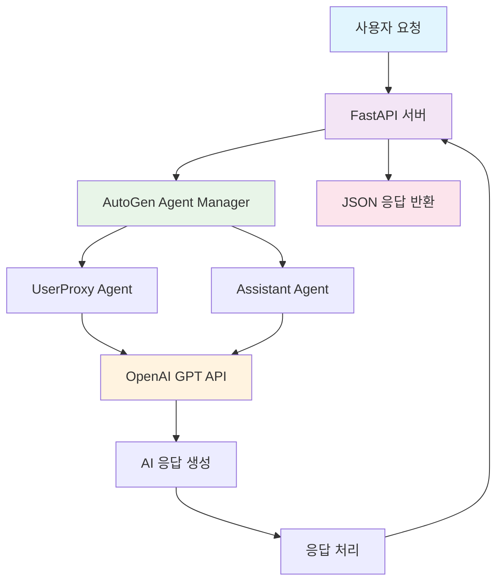

#### 시스템 컴포넌트 구성표

| 컴포넌트            | 역할                          | 기술 스택              | 포트/설정    |
| ------------------- | ----------------------------- | ---------------------- | ------------ |
| **FastAPI 서버**    | REST API 엔드포인트 제공      | FastAPI 0.104+         | 8000         |
| **AutoGen Manager** | AI Agent 관리 및 대화 조율    | pyautogen 0.9.0        | -            |
| **UserProxy Agent** | 사용자 입력 처리 및 대화 관리 | AutoGen UserProxyAgent | -            |
| **Assistant Agent** | AI 응답 생성 및 질문 처리     | AutoGen AssistantAgent | -            |
| **OpenAI API**  | 대화형 AI 모델 서비스         | GPT-4/GPT-3.5-turbo    | API Key 필요 |
| **프론트엔드**  | 간단한 웹 채팅 인터페이스     | HTML/JavaScript        | -            |

------

#### AutoGen Agent 구성

```python
# 09.chatbot_service/simple_chatbot_manager.py
#pip install fastapi uvicorn jinja2

import os
import json
import asyncio
from typing import Dict, Any, List, Optional
from dotenv import load_dotenv
import autogen
from autogen import UserProxyAgent, AssistantAgent

config_list_azure = [
        {
            "model": "gpt-4o",
            "api_key": "" # 실제 키 사용 시 주의,
            "base_url": "https://api.openai.com/v1",
        }
    ]
llm_config = {
    "cache_seed": None, # 임의의 시드값
    "temperature": 0.8, # LLM 응답의 다양성 제어
    "config_list" : config_list_azure
}

class SimpleChatbotManager:
    """간단한 채팅봇 Agent 관리 클래스"""
    
    def __init__(self):
        self.user_proxy = None
        self.assistant = None
        self._initialize_agents()
    
    def _initialize_agents(self):
        """Agent 초기화"""
        try:
            # UserProxy Agent 생성
            # 사용자의 입력을 받고 대화를 관리하는 역할
            self.user_proxy = UserProxyAgent(
                name="UserProxy",
                system_message="""
                당신은 사용자와 AI 어시스턴트 간의 대화를 중재하는 역할을 합니다.
                사용자의 질문을 정확히 이해하고 적절한 응답을 요청하세요.
                """.strip(),
                human_input_mode="NEVER",
                max_consecutive_auto_reply=3,
                code_execution_config=False,  # 코드 실행 비활성화
                llm_config=llm_config
            )
            
            # Assistant Agent 생성
            # 실제 AI 응답을 생성하는 역할
            self.assistant = AssistantAgent(
                name="Assistant",
                system_message="""
                당신은 도움이 되는 AI 어시스턴트입니다.
                사용자의 질문에 정확하고 친절하게 답변하세요.
                
                응답 원칙:
                1. 명확하고 이해하기 쉬운 한국어로 답변
                2. 질문의 의도를 정확히 파악하여 적절한 정보 제공
                3. 불확실한 정보는 추측하지 말고 모른다고 솔직히 답변
                4. 필요시 추가 질문을 통해 더 나은 답변 제공
                """.strip(),
                llm_config=llm_config,
                max_consecutive_auto_reply=3
            )
            
            print("✅ AutoGen Agents 초기화 완료")
            
        except Exception as e:
            print(f"❌ Agent 초기화 실패: {str(e)}")
            raise
    
    async def get_response(self, user_message: str) -> str:
        """
        사용자 메시지에 대한 AI 응답 생성
        
        Args:
            user_message (str): 사용자 입력 메시지
            
        Returns:
            str: AI 응답 메시지
        """
        try:
            print(f"🔄 메시지 처리 시작: {user_message[:50]}...")
            
            # 비동기 방식으로 대화 시작
            # initiate_chat 메서드를 통해 UserProxy가 Assistant와 대화 시작
            chat_result = await self.user_proxy.a_initiate_chat(
                self.assistant,
                message=user_message,
                silent=True
            )     
            
            # 대화 결과에서 마지막 응답 추출
            if hasattr(chat_result, 'chat_history') and chat_result.chat_history:
                # 마지막 메시지가 Assistant의 응답
                last_message = chat_result.chat_history[-1]
                response = last_message.get('content', '응답을 생성할 수 없습니다.')
            else:
                # chat_history가 없는 경우 대화 기록에서 추출
                messages = self.user_proxy.chat_messages.get(self.assistant, [])
                if messages:
                    response = messages[-1].get('content', '응답을 생성할 수 없습니다.')
                else:
                    response = "죄송합니다. 응답을 생성할 수 없습니다."
            
            print(f"✅ 응답 생성 완료: {len(response)}자")
            return response
            
        except Exception as e:
            error_msg = f"메시지 처리 중 오류가 발생했습니다: {str(e)}"
            print(f"❌ {error_msg}")
            return error_msg
    
    def reset_conversation(self):
        """대화 기록 초기화"""
        try:
            # 각 Agent의 대화 기록 초기화
            if hasattr(self.user_proxy, 'chat_messages'):
                self.user_proxy.chat_messages.clear()
            if hasattr(self.assistant, 'chat_messages'):
                self.assistant.chat_messages.clear()
            
            print("🔄 대화 기록 초기화 완료")
            
        except Exception as e:
            print(f"❌ 대화 기록 초기화 실패: {str(e)}")
    
    def get_agent_info(self) -> Dict[str, Any]:
        """Agent 정보 반환"""
        return {
            "user_proxy": {
                "name": self.user_proxy.name if self.user_proxy else None,
                "status": "활성" if self.user_proxy else "비활성"
            },
            "assistant": {
                "name": self.assistant.name if self.assistant else None,
                "status": "활성" if self.assistant else "비활성"
            },
        }

# 전역 Agent 관리자 인스턴스
chatbot_manager = None

def get_chatbot_manager() -> SimpleChatbotManager:
    """싱글톤 패턴으로 Agent 관리자 반환"""
    global chatbot_manager
    if chatbot_manager is None:
        chatbot_manager = SimpleChatbotManager()
    return chatbot_manager
```

------

#### FastAPI 서버 구현

```python
# 09.chatbot_service/main.py
from fastapi import FastAPI, HTTPException, Request
from fastapi.responses import HTMLResponse, JSONResponse
from fastapi.staticfiles import StaticFiles
from fastapi.templating import Jinja2Templates
from pydantic import BaseModel
from typing import Optional, Dict, Any
import os
import asyncio
import json
from datetime import datetime
import uvicorn

# 로컬 모듈 import
from agents.simple_agents import get_chatbot_manager


# FastAPI 앱 생성
app = FastAPI(
    title="AutoGen 간단 채팅봇 API",
    description="AutoGen과 FastAPI를 활용한 간단한 AI 채팅봇",
    version="1.0.0",
    docs_url="/docs",  # Swagger UI 경로
    redoc_url="/redoc"  # ReDoc 경로
)

# 정적 파일 및 템플릿 설정
templates = Jinja2Templates(directory="templates")

# Pydantic 모델 정의
class ChatRequest(BaseModel):
    """채팅 요청 모델"""
    message: str  # 사용자 메시지 (필수)
    reset_conversation: Optional[bool] = False  # 대화 기록 초기화 여부

class ChatResponse(BaseModel):
    """채팅 응답 모델"""
    success: bool  # 처리 성공 여부
    response: str  # AI 응답 메시지
    timestamp: str  # 응답 생성 시간
    processing_time: float  # 처리 시간 (초)
    agent_info: Dict[str, Any]  # Agent 정보

class HealthResponse(BaseModel):
    """서버 상태 응답 모델"""
    status: str
    message: str
    timestamp: str
    agent_status: Dict[str, Any]

# 전역 변수
startup_time = datetime.now()

@app.on_event("startup")
async def startup_event():
    """서버 시작 시 초기화 작업"""
    print("🚀 AutoGen FastAPI 채팅봇 서버 시작")
    print(f"⏰ 시작 시간: {startup_time}")
    
    try:
        # Agent 관리자 미리 초기화
        manager = get_chatbot_manager()
        print("✅ AutoGen Agent 관리자 초기화 완료")
    except Exception as e:
        print(f"❌ 서버 시작 중 오류: {str(e)}")

@app.on_event("shutdown")
async def shutdown_event():
    """서버 종료 시 정리 작업"""
    print("🛑 AutoGen FastAPI 채팅봇 서버 종료")

# API 엔드포인트

@app.get("/", response_class=HTMLResponse)
async def root(request: Request):
    """메인 페이지 - 간단한 채팅 인터페이스"""
    return templates.TemplateResponse("chat.html", {"request": request})

@app.get("/health", response_model=HealthResponse)
async def health_check():
    """서버 상태 확인 API"""
    try:
        # Agent 관리자 상태 확인
        manager = get_chatbot_manager()
        agent_info = manager.get_agent_info()
        
        return HealthResponse(
            status="healthy",
            message="서버가 정상적으로 실행 중입니다.",
            timestamp=datetime.now().isoformat(),
            agent_status=agent_info
        )
    except Exception as e:
        return HealthResponse(
            status="unhealthy",
            message=f"서버 상태 확인 중 오류: {str(e)}",
            timestamp=datetime.now().isoformat(),
            agent_status={}
        )

@app.post("/chat", response_model=ChatResponse)
async def chat_endpoint(request: ChatRequest):
    """
    채팅 API 엔드포인트
    
    사용자 메시지를 받아 AutoGen Agent를 통해 AI 응답을 생성합니다.
    """
    start_time = asyncio.get_event_loop().time()
    
    try:
        # 입력 검증
        if not request.message or not request.message.strip():
            raise HTTPException(
                status_code=400, 
                detail="메시지가 비어있습니다. 내용을 입력해주세요."
            )
        
        # Agent 관리자 가져오기
        manager = get_chatbot_manager()
        
        # 대화 기록 초기화 요청 처리
        if request.reset_conversation:
            manager.reset_conversation()
            print("🔄 사용자 요청으로 대화 기록 초기화")
        
        # AI 응답 생성
        print(f"📝 사용자 메시지: {request.message}")
        ai_response = await manager.get_response(request.message)
        
        # 처리 시간 계산
        processing_time = asyncio.get_event_loop().time() - start_time
        
        # 응답 생성
        response = ChatResponse(
            success=True,
            response=ai_response,
            timestamp=datetime.now().isoformat(),
            processing_time=round(processing_time, 2),
            agent_info=manager.get_agent_info()
        )
        
        print(f"✅ 응답 생성 완료 (처리시간: {processing_time:.2f}초)")
        return response
        
    except HTTPException:
        # HTTP 예외는 그대로 재발생
        raise
    except Exception as e:
        # 기타 예외 처리
        error_msg = f"채팅 처리 중 오류가 발생했습니다: {str(e)}"
        print(f"❌ {error_msg}")
        
        processing_time = asyncio.get_event_loop().time() - start_time
        
        return ChatResponse(
            success=False,
            response=error_msg,
            timestamp=datetime.now().isoformat(),
            processing_time=round(processing_time, 2),
            agent_info={}
        )

@app.post("/reset")
async def reset_conversation():
    """대화 기록 초기화 API"""
    try:
        manager = get_chatbot_manager()
        manager.reset_conversation()
        
        return JSONResponse(
            content={
                "success": True,
                "message": "대화 기록이 초기화되었습니다.",
                "timestamp": datetime.now().isoformat()
            }
        )
    except Exception as e:
        error_msg = f"대화 기록 초기화 중 오류: {str(e)}"
        print(f"❌ {error_msg}")
        
        return JSONResponse(
            status_code=500,
            content={
                "success": False,
                "message": error_msg,
                "timestamp": datetime.now().isoformat()
            }
        )

@app.get("/info")
async def get_agent_info():
    """Agent 정보 조회 API"""
    try:
        manager = get_chatbot_manager()
        agent_info = manager.get_agent_info()
        
        return JSONResponse(
            content={
                "success": True,
                "data": agent_info,
                "server_uptime": str(datetime.now() - startup_time),
                "timestamp": datetime.now().isoformat()
            }
        )
    except Exception as e:
        error_msg = f"Agent 정보 조회 중 오류: {str(e)}"
        print(f"❌ {error_msg}")
        
        return JSONResponse(
            status_code=500,
            content={
                "success": False,
                "message": error_msg,
                "timestamp": datetime.now().isoformat()
            }
        )

# 서버 실행 함수
def run_server():
    """개발 서버 실행"""
    uvicorn.run(
        "main:app",
        host=os.getenv("HOST", "0.0.0.0"),
        port=int(os.getenv("PORT", "8000")),
        reload=os.getenv("DEBUG", "True").lower() == "true",
        log_level="info"
    )

if __name__ == "__main__":
    run_server()
```

------

####  웹 인터페이스 구현

```html
<!-- templates/chat.html -->
<!DOCTYPE html>
<html lang="ko">
<head>
    <meta charset="UTF-8">
    <meta name="viewport" content="width=device-width, initial-scale=1.0">
    <title>AutoGen 간단 채팅봇</title>
    <style>
        * {
            margin: 0;
            padding: 0;
            box-sizing: border-box;
        }

        body {
            font-family: 'Segoe UI', Tahoma, Geneva, Verdana, sans-serif;
            background: linear-gradient(135deg, #667eea 0%, #764ba2 100%);
            height: 100vh;
            display: flex;
            justify-content: center;
            align-items: center;
        }

        .chat-container {
            background: white;
            border-radius: 20px;
            box-shadow: 0 20px 40px rgba(0,0,0,0.1);
            width: 90%;
            max-width: 800px;
            height: 80vh;
            display: flex;
            flex-direction: column;
            overflow: hidden;
        }

        .chat-header {
            background: linear-gradient(135deg, #667eea 0%, #764ba2 100%);
            color: white;
            padding: 20px;
            text-align: center;
            position: relative;
        }

        .chat-header h1 {
            margin: 0;
            font-size: 1.5em;
        }

        .chat-header .subtitle {
            font-size: 0.9em;
            opacity: 0.8;
            margin-top: 5px;
        }

        .reset-btn {
            position: absolute;
            right: 20px;
            top: 50%;
            transform: translateY(-50%);
            background: rgba(255,255,255,0.2);
            border: none;
            color: white;
            padding: 8px 15px;
            border-radius: 15px;
            cursor: pointer;
            font-size: 0.8em;
            transition: background 0.3s;
        }

        .reset-btn:hover {
            background: rgba(255,255,255,0.3);
        }

        .chat-messages {
            flex: 1;
            padding: 20px;
            overflow-y: auto;
            background: #f8f9fa;
        }

        .message {
            margin-bottom: 15px;
            animation: fadeInUp 0.3s ease;
        }

        @keyframes fadeInUp {
            from {
                opacity: 0;
                transform: translateY(20px);
            }
            to {
                opacity: 1;
                transform: translateY(0);
            }
        }

        .message.user {
            text-align: right;
        }

        .message.bot {
            text-align: left;
        }

        .message-content {
            display: inline-block;
            padding: 12px 18px;
            border-radius: 18px;
            max-width: 70%;
            word-wrap: break-word;
            line-height: 1.4;
        }

        .message.user .message-content {
            background: linear-gradient(135deg, #667eea 0%, #764ba2 100%);
            color: white;
        }

        .message.bot .message-content {
            background: white;
            color: #333;
            border: 1px solid #e0e0e0;
            box-shadow: 0 2px 5px rgba(0,0,0,0.1);
        }

        .message-time {
            font-size: 0.7em;
            opacity: 0.6;
            margin-top: 5px;
        }

        .chat-input {
            padding: 20px;
            background: white;
            border-top: 1px solid #e0e0e0;
        }

        .input-group {
            display: flex;
            gap: 10px;
        }

        .message-input {
            flex: 1;
            padding: 12px 18px;
            border: 2px solid #e0e0e0;
            border-radius: 25px;
            font-size: 1em;
            outline: none;
            transition: border-color 0.3s;
        }

        .message-input:focus {
            border-color: #667eea;
        }

        .send-btn {
            background: linear-gradient(135deg, #667eea 0%, #764ba2 100%);
            color: white;
            border: none;
            padding: 12px 20px;
            border-radius: 25px;
            cursor: pointer;
            font-size: 1em;
            transition: transform 0.2s;
        }

        .send-btn:hover {
            transform: scale(1.05);
        }

        .send-btn:disabled {
            opacity: 0.6;
            cursor: not-allowed;
            transform: none;
        }

        .loading {
            text-align: center;
            padding: 20px;
            color: #666;
        }

        .loading::after {
            content: '...';
            animation: dots 1.5s infinite;
        }

        @keyframes dots {
            0%, 20% { content: '.'; }
            40% { content: '..'; }
            60%, 100% { content: '...'; }
        }

        .status-info {
            position: absolute;
            bottom: 10px;
            right: 10px;
            background: rgba(0,0,0,0.1);
            color: white;
            padding: 5px 10px;
            border-radius: 10px;
            font-size: 0.7em;
            opacity: 0.7;
        }

        /* 반응형 디자인 */
        @media (max-width: 768px) {
            .chat-container {
                width: 95%;
                height: 90vh;
                border-radius: 10px;
            }
            
            .message-content {
                max-width: 85%;
            }
            
            .reset-btn {
                display: none;
            }
        }
    </style>
</head>
<body>
    <div class="chat-container">
        <div class="chat-header">
            <h1>🤖 AutoGen 채팅봇</h1>
            <div class="subtitle">FastAPI + AutoGen 기반 AI 어시스턴트</div>
            <button class="reset-btn" onclick="resetConversation()">대화 초기화</button>
            <div class="status-info" id="statusInfo">준비됨</div>
        </div>
        
        <div class="chat-messages" id="chatMessages">
            <div class="message bot">
                <div class="message-content">
                    안녕하세요! 👋<br>
                    저는 AutoGen과 FastAPI로 만들어진 AI 어시스턴트입니다.<br>
                    궁금한 것이 있으시면 언제든 질문해주세요!
                </div>
                <div class="message-time">방금 전</div>
            </div>
        </div>
        
        <div class="chat-input">
            <div class="input-group">
                <input 
                    type="text" 
                    id="messageInput" 
                    class="message-input" 
                    placeholder="메시지를 입력하세요..."
                    onkeypress="handleKeyPress(event)"
                >
                <button class="send-btn" id="sendBtn" onclick="sendMessage()">
                    전송
                </button>
            </div>
        </div>
    </div>

    <script>
        // 전역 변수
        let isLoading = false;
        
        // DOM 요소
        const chatMessages = document.getElementById('chatMessages');
        const messageInput = document.getElementById('messageInput');
        const sendBtn = document.getElementById('sendBtn');
        const statusInfo = document.getElementById('statusInfo');

        // 초기화
        document.addEventListener('DOMContentLoaded', function() {
            messageInput.focus();
            checkServerHealth();
        });
                    
		// 서버 상태 확인
        async function checkServerHealth() {
            try {
                const response = await fetch('/health');
                const data = await response.json();
                
                if (data.status === 'healthy') {
                    statusInfo.textContent = '온라인';
                    statusInfo.style.background = 'rgba(40, 167, 69, 0.8)';
                } else {
                    statusInfo.textContent = '오프라인';
                    statusInfo.style.background = 'rgba(220, 53, 69, 0.8)';
                }
            } catch (error) {
                console.error('서버 상태 확인 실패:', error);
                statusInfo.textContent = '연결 실패';
                statusInfo.style.background = 'rgba(220, 53, 69, 0.8)';
            }
        }

        // Enter 키 처리
        function handleKeyPress(event) {
            if (event.key === 'Enter' && !event.shiftKey) {
                event.preventDefault();
                sendMessage();
            }
        }

        // 메시지 전송
        async function sendMessage() {
            const message = messageInput.value.trim();
            
            if (!message || isLoading) {
                return;
            }

            // UI 업데이트
            addMessage('user', message);
            messageInput.value = '';
            setLoading(true);

            try {
                // API 호출
                const response = await fetch('/chat', {
                    method: 'POST',
                    headers: {
                        'Content-Type': 'application/json',
                    },
                    body: JSON.stringify({
                        message: message,
                        reset_conversation: false
                    })
                });

                const data = await response.json();

                if (data.success) {
                    addMessage('bot', data.response, data.processing_time);
                    
                    // 상태 정보 업데이트
                    if (data.agent_info && data.agent_info.total_messages) {
                        statusInfo.textContent = `메시지 ${data.agent_info.total_messages}개`;
                    }
                } else {
                    addMessage('bot', `오류: ${data.response}`, null, true);
                }
            } catch (error) {
                console.error('메시지 전송 실패:', error);
                addMessage('bot', '서버와의 통신에 실패했습니다. 잠시 후 다시 시도해주세요.', null, true);
            } finally {
                setLoading(false);
            }
        }

        // 메시지 추가
        function addMessage(sender, content, processingTime = null, isError = false) {
            const messageDiv = document.createElement('div');
            messageDiv.className = `message ${sender}`;

            const contentDiv = document.createElement('div');
            contentDiv.className = 'message-content';
            
            if (isError) {
                contentDiv.style.background = '#ffe6e6';
                contentDiv.style.color = '#d32f2f';
                contentDiv.style.borderColor = '#ffcdd2';
            }
            
            // 메시지 내용 처리 (줄바꿈 지원)
            contentDiv.innerHTML = content.replace(/\n/g, '<br>');

            const timeDiv = document.createElement('div');
            timeDiv.className = 'message-time';
            
            let timeText = new Date().toLocaleTimeString('ko-KR', {
                hour: '2-digit',
                minute: '2-digit'
            });
            
            if (processingTime) {
                timeText += ` (처리시간: ${processingTime}초)`;
            }
            
            timeDiv.textContent = timeText;

            messageDiv.appendChild(contentDiv);
            messageDiv.appendChild(timeDiv);
            chatMessages.appendChild(messageDiv);

            // 스크롤을 맨 아래로
            chatMessages.scrollTop = chatMessages.scrollHeight;
        }

        // 로딩 상태 설정
        function setLoading(loading) {
            isLoading = loading;
            sendBtn.disabled = loading;
            messageInput.disabled = loading;
            
            if (loading) {
                sendBtn.textContent = '전송 중...';
                
                // 로딩 메시지 추가
                const loadingDiv = document.createElement('div');
                loadingDiv.className = 'loading';
                loadingDiv.id = 'loadingMessage';
                loadingDiv.textContent = 'AI가 답변을 생성하고 있습니다';
                chatMessages.appendChild(loadingDiv);
                chatMessages.scrollTop = chatMessages.scrollHeight;
            } else {
                sendBtn.textContent = '전송';
                messageInput.focus();
                
                // 로딩 메시지 제거
                const loadingMessage = document.getElementById('loadingMessage');
                if (loadingMessage) {
                    loadingMessage.remove();
                }
            }
        }

        // 대화 초기화
        async function resetConversation() {
            if (!confirm('대화 기록을 모두 삭제하시겠습니까?')) {
                return;
            }

            try {
                const response = await fetch('/reset', {
                    method: 'POST',
                    headers: {
                        'Content-Type': 'application/json',
                    }
                });

                const data = await response.json();

                if (data.success) {
                    // 채팅 메시지 초기화
                    chatMessages.innerHTML = `
                        <div class="message bot">
                            <div class="message-content">
                                대화 기록이 초기화되었습니다. 🔄<br>
                                새로운 대화를 시작해보세요!
                            </div>
                            <div class="message-time">방금 전</div>
                        </div>
                    `;
                    
                    // 상태 정보 리셋
                    statusInfo.textContent = '온라인';
                    
                    // 포커스 설정
                    messageInput.focus();
                    
                    console.log('대화 기록 초기화 완료');
                } else {
                    alert('대화 기록 초기화에 실패했습니다: ' + data.message);
                }
            } catch (error) {
                console.error('대화 초기화 실패:', error);
                alert('서버와의 통신에 실패했습니다.');
            }
        }

        // Agent 정보 조회 (선택사항)
        async function getAgentInfo() {
            try {
                const response = await fetch('/info');
                const data = await response.json();
                
                if (data.success) {
                    console.log('Agent 정보:', data.data);
                    return data.data;
                }
            } catch (error) {
                console.error('Agent 정보 조회 실패:', error);
            }
            return null;
        }

        // 키보드 단축키 지원
        document.addEventListener('keydown', function(event) {
            // Ctrl + R: 대화 초기화
            if (event.ctrlKey && event.key === 'r') {
                event.preventDefault();
                resetConversation();
            }
            
            // Escape: 입력 필드 포커스
            if (event.key === 'Escape') {
                messageInput.focus();
                messageInput.select();
            }
        });

        // 주기적 상태 확인 (30초마다)
        setInterval(checkServerHealth, 30000);

        // 페이지 가시성 변경 시 상태 확인
        document.addEventListener('visibilitychange', function() {
            if (!document.hidden) {
                checkServerHealth();
            }
        });

        // 윈도우 크기 변경 시 스크롤 조정
        window.addEventListener('resize', function() {
            setTimeout(() => {
                chatMessages.scrollTop = chatMessages.scrollHeight;
            }, 100);
        });

        // 개발자 도구에서 사용할 수 있는 유틸리티 함수들
        window.chatUtils = {
            sendMessage: sendMessage,
            resetConversation: resetConversation,
            getAgentInfo: getAgentInfo,
            checkServerHealth: checkServerHealth,
            addMessage: addMessage
        };

        console.log('🤖 AutoGen 채팅봇 인터페이스 로드 완료');
        console.log('💡 개발자 도구에서 window.chatUtils로 유틸리티 함수에 접근할 수 있습니다.');
    </script>
</body>
</html>                    
```

#### 실행

```bash
 uvicorn main:app --reload
```

## 5. MCP 개요

Model Context Protocol(MCP)는 LLM 애플리케이션과 외부 데이터 소스 및 도구 간의 원활한 연동을 가능하게 해주는 오픈 프로토콜이다. 
AI 기반 IDE를 만들거나, 채팅 인터페이스를 개선하거나, 맞춤형 AI 워크플로우를 구축하든 MCP는 LLM이 필요한 컨텍스트에 표준화된 방식으로 접근할 수 있는 환경을 제공한다.
LLM이 내가 사용하는 어플리케이션을 하나의 도구로 활용할 수 있게 만들어주는 방법이다.

- LLM이 바로 연결해 사용할 수 있는 다양한 사전 구축된 통합 기능 제공
- LLM 제공업체 간 유연한 전환 가능
- 자체 인프라 내에서 데이터를 안전하게 보호할 수 있는 베스트 프랙티스 제공

### 5.1 주요 구성 요소

- MCP(Model Context Protocol)는 AI가 외부 데이터와 도구에 쉽게 접근할 수 있도록 표준화된 연결 방식을 제공하는 구조이다.

- 이 구조는 MCP 호스트, 클라이언트, 서버, 그리고 로컬 데이터 소스와 원격 서비스 등으로 구성되며 각 역할이 명확히 분리되어 관리와 확장, 그리고 보안 측면에서 효과적이다.


- MCP 호스트: Claude Desktop, IDE, 기타 AI 도구처럼 MCP를 통해 데이터에 접근하고자 하는 프로그램들
- MCP 클라이언트: 서버와 1:1 연결을 유지하는 프로토콜 클라이언트
- MCP 서버: 특화된 컨텍스트와 기능을 제공
- 로컬 데이터 소스: 사용자의 컴퓨터에 있는 파일, 데이터베이스, 서비스 등 MCP 서버가 안전하게 접근할 수 있는 로컬 자원
- 원격 서비스: API 등을 통해 인터넷 상에서 접근 가능한 외부 시스템으로, MCP 서버가 연결할 수 있음


### 5.2 MCP 작동 방식

**연결 설정 (connection establishment)**

- 호스트가 MCP 클라이언트를 생성
- 클라이언트는 MCP 서버와 연결 설정
- 연결 설정 과정에서 프로토콜 버전, 기능, 권한 등 설정


**컨텍스트 교환 (Context Exchange)**

- 서버는 클라이언트에게 데이터 소스의 컨텍스트 정보를 제공
- 클라이언트는 이 정보를 호스트 프로세스에 전달
- 호스트 프로세스트는 여러 클라이언트로부터 받은 컨텍스트를 집계하여 AI 모델에 제공


**도구 호출 (Tool Invocation)**

- AI 모델은 특정 작업을 수행하기 위해 도구 호출 요청
- 호스트 프로세스는 이 요청을 적절한 클라이언트에 전달
- 클라이언트는 서버에 도구 호출 요청 전송
- 서버는 요청된 작업을 수행하고 결과를 클라이언트에 반환


**결과 처리**

- 클라이언트는 서버로부터 받은 결과를 호스트 프로세스에 전달
- 호스트 프로세스는 이 결과를 AI 모델에 제공
- AI 모델은 이 정보를 바탕으로 응답 생성


### 5.3 연동 방식

| 구분               | stdio (Standard IO)                                          | SSE (Server-Sent Events)                                     | Streamable-HTTP                                              |
| :----------------- | :----------------------------------------------------------- | :----------------------------------------------------------- | :----------------------------------------------------------- |
| **개념**           | 로컬 프로세스 간 표준 입력/출력 스트림을 통한 통신           | HTTP 프로토콜 기반, 서버가 클라이언트에 실시간 이벤트를 푸시하는 방식 | HTTP/1.1 이상에서 다중 메시지를 스트리밍하는 방식            |
| **통신 방식**  | 프로세스 간 표준 입출력 스트림을 사용하여 JSON-RPC 메시지 교환 | 클라이언트가 서버에 연결 후 서버가 이벤트 스트림을 지속적으로 전송 | 클라이언트 요청에 대해 서버가 지속적으로 데이터를 부분 전송하며 응답 스트림 유지 |
| **적용 영역**  | 로컬 환경, 개발 및 테스트 용도에 적합                        | 원격 서버와 클라이언트 간 실시간 데이터 전송 및 알림에 적합  | 복잡한 실시간 데이터 교환, 다중 메시지 처리에 적합           |
| **장점**           | - 설정 간단하고 빠름 - 네트워크 오버헤드 없음                | - HTTP 프로토콜 활용으로 웹 호환성 우수 - 단방향 실시간 전달 가능 | - HTTP 표준 기반 - 다중 메시지 스트리밍에 효율적             |
| **단점**           | - 로컬 한정 - 멀티 클라이언트 지원 어려움                    | - 단방향 통신 (서버→클라이언트) - 브라우저 지원 제한적       | - 구현 복잡 - 기존 HTTP 라이브러리 및 서버 지원 필요         |
| **통신 프로토콜**  | JSON-RPC 2.0 메시지를 stdin/stdout으로 처리                  | HTTP/1.1, MIME type: text/event-stream                       | HTTP/1.1 이상의 스트리밍 응답 (Chunked Transfer Encoding 등) |
| **연결 지속성**    | 상태 유지 연결 (stateful)                                    | 지속 연결 (long-lived connection)                            | 지속 연결, 다중 메시지 처리 가능                             |
| **보안 및 확장성** | 로컬 환경에 특화 원격, 분산 환경에는 제한적                  | 웹 서비스 환경에 적합 확장성 클라이언트 수 제한              | 고성능, 다중 클라이언트 동시 처리 가능                       |
| **대표 사용 사례** | 개발 중 서버-클라이언트 간 통신 테스트 및 디버깅             | 실시간 알림, 이벤트 전송 웹소켓 대안으로 사용                | 대용량 실시간 데이터 스트리밍 AI 응답 스트리밍 등에 활용     |


### 5.4 도구 및 리소스

#### 도구 (Tools)

도구는 MCP 서버에서 실행 가능한 기능을 나타냅니다.

##### 도구 분류

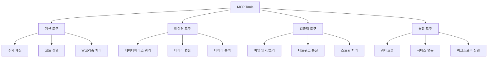

##### 도구 정의 스키마

| 속성          | 타입   | 필수 | 설명                    |
| ------------- | ------ | ---- | ----------------------- |
| `name`        | string | ✓    | 도구 이름 (고유 식별자) |
| `description` | string | ✓    | 도구 설명               |
| `parameters`  | object | -    | 입력 매개변수 스키마    |
| `returns`     | object | -    | 반환값 스키마           |
| `examples`    | array  | -    | 사용 예제               |
| `tags`        | array  | -    | 분류 태그               |

#### 리소스 (Resources)

리소스는 MCP 서버에서 제공하는 정적 또는 동적 데이터입니다.

##### 리소스 유형

| 유형       | 설명               | 예시                       |
| ---------- | ------------------ | -------------------------- |
| **구성**   | 서버 설정 정보     | 설정 파일, 환경 변수       |
| **문서**   | 도움말 및 문서     | API 문서, 사용 가이드      |
| **스키마** | 데이터 구조 정의   | JSON 스키마, 데이터 모델   |
| **템플릿** | 재사용 가능한 패턴 | 코드 템플릿, 설정 템플릿   |
| **데이터** | 동적 데이터 콘텐츠 | 실시간 데이터, 캐시된 결과 |

##### 리소스 URI 스키마

```
mcp://[authority]/[path]?[query]#[fragment]
```

예시:

- `mcp://config/server.json` - 서버 설정
- `mcp://docs/api/tools` - API 문서
- `mcp://data/users?filter=active` - 사용자 데이터

#### 컨텍스트 (Context)

컨텍스트는 대화 상태와 히스토리를 관리합니다.

##### 컨텍스트 구조

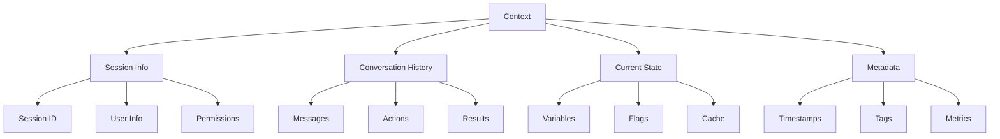


### 5.5 MCP 서버 개발

#### MCP 생태계

**2024년 초기**: Anthropic이 MCP 프로토콜 발표와 함께 공식 SDK 제공

- TypeScript SDK (완전한 기능)
- Python SDK (기본 기능)

**2024년 중반**: 커뮤니티 주도 프로젝트 등장

- **FastMCP 1.0**: Python 개발자를 위한 간소화된 인터페이스
- 높은 인기와 활발한 커뮤니티 형성

**2024년 말**: 생태계 통합과 발전

- **FastMCP 1.0 → 공식 Python SDK 통합**
- **FastMCP 2.0**: 독립적 발전 지속, 고급 기능 추가

#### 주요 구현체

| 구현체                 | 개발사/개발자 | 상태           | 특징                       |
| :--------------------- | :------------ | :------------- | :------------------------- |
| **MCP TypeScript SDK** | Anthropic     | 공식, 활발     | 완전한 기능, 레퍼런스 구현 |
| **MCP Python SDK**     | Anthropic     | 공식, 활발     | FastMCP 1.0 통합, 안정적   |
| **FastMCP 2.0**        | Prefect       | 서드파티, 활발 | 고급 기능, 개발자 친화적   |
| **FastMCP 초기버전**   | 커뮤니티      | 레거시         | 많은 프로젝트에서 사용 중  |

#### 장단점 비교

| 구분        | 공식 MCP Python SDK                       | FastMCP 2.0                                    |
| :---------- | :---------------------------------------- | :--------------------------------------------- |
| 장점        | - 공식 지원: Anthropic의 장기 지원 보장   | - 개발 속도: 매우 빠른 프로토타이핑            |
|             | - 표준 준수: MCP 프로토콜의 정확한 구현   | - Python스러움: 직관적이고 자연스러운 API      |
|             | - 안정성: 엄격한 테스트와 검증            | - 풍부한 기능: Context, 프록시, 컴포지션 등    |
|             | - 호환성: 모든 MCP 클라이언트와 완벽 호환 | - 완전한 플랫폼: 서버 + 클라이언트 + 배포 도구 |
|             | - 문서화: 공식 문서와 예제 풍부           | - 현대적 설계: 최신 Python 기능 활용           |
| 단점        | - 복잡성: 상대적으로 많은 보일러플레이트  | - 서드파티: 공식 지원 없음                     |
|             | - 학습 곡선: 초기 진입 장벽 존재          | - 변화 가능성: API가 변경될 수 있음            |
|             | - 기능 제한: 기본적인 MCP 기능에 집중     | - 의존성: 특정 개발자/조직에 의존              |
|             |                                           | - 학습 자료: 상대적으로 제한적                 |
| 적합한 경우 | - 프로덕션 환경의 안정적인 서버           | - 빠른 프로토타이핑과 실험                     |
|             | - 장기적으로 유지보수할 프로젝트          | - 고급 기능이 필요한 복잡한 서버               |
|             | - 표준 준수가 중요한 기업 환경            | - Python 생태계를 깊이 활용하고 싶을 때        |
|             | - MCP 프로토콜을 정확히 학습하고 싶을 때  | - 최신 기능을 적극 활용하고 싶을 때            |


### 5.6 FastMCP

 FastMCP는 MCP 서버와 클라이언트를 간단하게 생성할 수 있도록 설계된 고수준의 Pythonic 프레임워크이다.

#### 기본 어노테이션 구조

FastMCP에서는 세 가지 핵심 컴포넌트를 어노테이션으로 정의합니다:

```
from mcp.server.fastmcp import FastMCP

mcp = FastMCP("서버_이름")

# 도구 정의
@mcp.tool()
def 도구_함수(파라미터: 타입) -> 반환타입:
    """LLM에게 보여질 설명"""
    # 구현부

# 프롬프트 정의
@mcp.prompt()
def 프롬프트_함수(파라미터: str) -> str:
    """프롬프트 설명"""
    # 구현부
```

#### 도구 어노테이션 (`@mcp.tool()`)

LLM이 호출할 수 있는 함수를 정의합니다:

```
@mcp.tool(
    name="custom_name",  # 옵션: LLM에 노출될 이름 변경
    description="상세 설명",  # 옵션: 기본 독스트링 대체
    async_func=True  # 옵션: 비동기 함수일 경우
)
def weather_api(city: str) -> dict:
    """특정 도시의 현재 날씨를 조회합니다"""
    # API 호출 구현
    return {"temperature": 23, "condition": "sunny"}
```

**핵심 특징**:

- 파라미터 타입 어노테이션 필수 (`str`, `int`, `bool` 등)
- 독스트링이 LLM에게 기능 설명 제공
- 반환 타입 명시 권장

#### 리소스 어노테이션 (`@mcp.resource()`)

애플리케이션이 제공하는 데이터 소스를 정의합니다:

```
@mcp.resource(
    uri="data://application-info",
    name="AppInfo",
    description="애플리케이션 런타임 정보",
    mime_type="application/json"
)
async def get_app_status() -> dict:
    return {
        "version": "1.4.2",
        "status": "running",
        "uptime": "36 hours"
    }
```

**설정 옵션**:

- `uri`: 리소스 고유 식별자 (형식: `scheme://path`)
- `mime_type`: 반환 데이터 형식 (기본: `text/plain`)
- `tags`: 검색용 태그 설정 (예: `tags={"monitoring", "status"}`)

#### 프롬프트 어노테이션 (`@mcp.prompt()`)

재사용 가능한 프롬프트 템플릿 정의:

```
from mcp.server.fastmcp.prompts import base

@mcp.prompt()
def debug_error(error: str) -> list[base.Message]:
    """에러 디버깅을 위한 프롬프트
    
    Args:
        error: 발생한 에러 메시지
    """
    return [
        base.Message(
            role="user",
            content=[
                base.TextContent(
                    text=f"다음 에러를 해결하는 방법: {error}. 단계별 가이드 제공"
                )
            ]
        )
    ]
```

#### 파라미터 메타데이터 확장

`pydantic.Field`로 파라미터 정보 풍부화:

```
from typing import Annotated
from pydantic import Field

@mcp.tool()
def image_processor(
    image_url: Annotated[
        str, 
        Field(description="처리할 이미지 URL", max_length=2083)
    ],
    format: Annotated[
        Literal["jpeg", "png", "webp"],
        Field(description="출력 포맷")
    ] = "jpeg"
) -> dict:
    """이미지 처리 도구"""
    # 구현부
```

**메타데이터 종류**:

- `description`: 파라미터 설명
- `ge`/`le`: 숫자 범위 제한 (예: `ge=1, le=100`)
- `max_length`/`min_length`: 문자열 길이 제한
- `pattern`: 정규식 패턴


### 5.7 MCP 예제

#### MCP 서버 

Python MCP SDK는 MCP 사양을 완전히 구현하고 있어 다음과 같은 작업을 쉽게 수행할 수 있다.

- 어떤 MCP 서버와도 연결할 수 있는 MCP 클라이언트 구축
- 리소스, 프롬프트, 도구 등을 노출하는 MCP 서버 생성
- stdio, SSE 같은 표준 전송 방식 사용
- 모든 MCP 프로토콜 메시지와 생명주기 이벤트 처리


**Install**

해당 실습은 MS Autogen을 사용한다. 

```
# 기존 autogen 삭제 또는 새로운 가상환경 생성
# pip 통한 설치 
pip install mcp
pip install fastmcp
pip install autogen
pip install "autogen-ext[openai,mcp]>=0.4.2"
```


**MCP 서버 구현**

덧셈 계산기와 인사하는 MCP 서버 생성.

```
#mcp_server_sample.py
from mcp.server.fastmcp import FastMCP

# Create an MCP server
mcp = FastMCP("mcp_project")

# Add an additional tool
@mcp.tool()
def add(a: int, b: int) -> int:
    """Add two numbers"""
    return a + b


if __name__ == "__main__":
    mcp.run()
```


#### Claude 연동

이 서버는 [Claude Desktop](https://claude.ai/download)에 설치할 수 있으며, 아래 명령어를 실행하면 즉시 서버와 상호작용할 수 있다.

MCP 설정(WSL)

```json
#C:\Users\{사용자}\AppData\Roaming\Claude
{
  "mcpServers": {
    "mcp-server": {
      "command": "wsl",
      "args": [
        "-e", 
        "bash", 
        "-c", 
        "source /home/{사용자}/aiagent-env/bin/activate && python /home/{사용자}/aiagent-sample/mcp_server.py"
      ],
      "env": {
        "PYTHONUNBUFFERED": "1"
      }
    }
  }
}
```

MCP 설정(Windows)

```
#C:\Users\{사용자}\AppData\Roaming\Claude
{
  "mcpServers": {
    "mcp-server": {
      "command": "C:\\Users\\{사용자}\\aiagent-env\\Scripts\\python.exe",
      "args": [
        "C:\\Users\\{사용자}\\aiagent-sample\\mcp_server.py"
      ],
      "env": {
        "PYTHONUNBUFFERED": "1",
        "VIRTUAL_ENV": "C:\\Users\\{사용자}\\aiagent-env"
      }
    }
  }
}
```


이제 Claude Desktop을 실행시키면 도구와 mcp 서버가 연동된 것을 볼 수 있다.


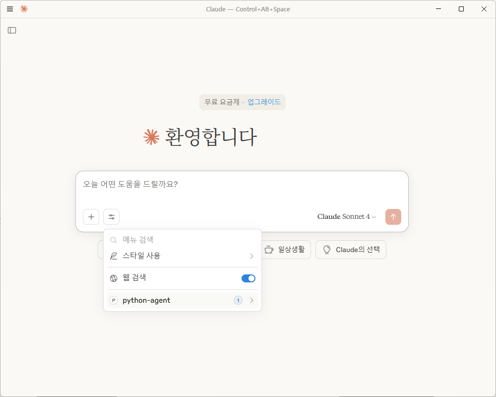

1+2를 질문한다.


#### stdio 기반(로컬)

##### mcp 서버

```python
# mcp_server.py
# pip install mcp 
from mcp.server.fastmcp import FastMCP

mcp = FastMCP("McpServer")

@mcp.tool()
def add(a: int, b: int) -> int:
    """Add two numbers"""
    return a + b

@mcp.tool()
def multiply(a: int, b: int) -> int:
    """Multiply two numbers"""
    return a * b

files = {
    "ag2": "AG has released 0.8.5 version on 2025-04-03",
}

if __name__ == "__main__":
    parser = argparse.ArgumentParser(description="MCP Server")
    parser.add_argument("transport", choices=["stdio", "sse"], help="Transport mode (stdio or sse)")
    args = parser.parse_args()

    mcp.run(transport=args.transport)

```
##### MCP 클라이언트

```python
# mcp_client_stdio.py
import asyncio
import os
from autogen_ext.models.openai import AzureOpenAIChatCompletionClient
from autogen_ext.tools.mcp import StreamableHttpMcpToolAdapter, StdioServerParams, mcp_server_tools
from autogen_agentchat.agents import AssistantAgent
from autogen_agentchat.ui import Console
from autogen_core import CancellationToken
from datetime import timedelta
import logging
from autogen_agentchat import EVENT_LOGGER_NAME, TRACE_LOGGER_NAME

# Trace 로그 (디버깅용)
trace_logger = logging.getLogger(TRACE_LOGGER_NAME)
trace_logger.addHandler(logging.StreamHandler())
trace_logger.setLevel(logging.DEBUG)
1
# 이벤트 로그 (구조화 메시지)
event_logger = logging.getLogger(EVENT_LOGGER_NAME)
event_logger.addHandler(logging.StreamHandler())
event_logger.setLevel(logging.DEBUG)

async def setup_mcp_tools():
    """MCP 서버에서 도구들을 설정"""
    server_params = StdioServerParams(
        command="python",
        args=["D:\\Dev\\01.Lectures\\AI_BASIC_LECTURE_KWS\\autogen\\mcp_server.py"],
        )
    
    tools = await mcp_server_tools(server_params)
    return tools

async def setup_azure_client():
    """Azure OpenAI 클라이언트 설정"""
    try:         
        model_client = OpenAIChatCompletionClient(
            model="gpt-4o",
            api_key= "", # 실제 키 사용 시 주의
            base_url="https://api.openai.com/v1"
            )
        
        print("✅ Azure OpenAI 클라이언트 설정 완료 (표준 모델명)")
        return model_client
    except Exception as e:
        print(f"⚠️ 표준 모델명 설정 실패, 커스텀 모델 정보로 재시도: {e}")

async def main():
    print("🚀 Autogen MCP 클라이언트 시작\n")
    
    try:
        # 1. MCP 도구 설정
        print("🔧 MCP 도구 연결 중...")
        tools = await setup_mcp_tools()
        
        if not tools:
            print("❌ MCP 도구를 찾을 수 없습니다. MCP 서버가 실행되고 있는지 확인하세요.")
            return
        
        # 2. Azure OpenAI 클라이언트 설정
        print("\n🤖 Azure OpenAI 클라이언트 설정 중...")
        model_client = await setup_azure_client()
        
        # 3. Assistant Agent 생성
        print("\n👨‍💼 Assistant Agent 생성 중...")
        agent = AssistantAgent(
            name="versatile_assistant",
            model_client=model_client,
            tools=tools,
            system_message="""You are a versatile assistant with access to weather, calculation, and file information tools.

Available tools:
- add(expression): Perform mathematical calculations  

Always use the appropriate tools when asked to perform tasks that match their capabilities.
Provide clear, helpful responses and explain what tools you're using."""
        )
        
        # 4. 작업 실행
        print("\n🎯 작업 실행 중...\n")
        await Console(
            agent.run_stream(
                task="""안녕하세요! 다음 작업들을 도와주세요:

1. 123223 + 456789를 계산해주세요

각 작업에 적절한 도구를 사용해서 수행해주세요.""",
                cancellation_token=CancellationToken()
            )
        )
        
    except Exception as e:
        print(f"\n❌ 오류 발생: {e}")
        print("\n🔧 문제 해결 방법:")
        print("1. MCP 서버가 실행되고 있는지 확인 (python mcp_server.py)")
        print("2. 환경변수가 올바르게 설정되어 있는지 확인")
        print("3. Azure OpenAI 배포명과 엔드포인트 확인")


if __name__ == "__main__":
    asyncio.run(main())
   

```

#### http 기반(리모트)

##### mcp 서버

```python
# pip 
# pip install fastapi_mcp
from typing import List
from mcp.server.fastmcp import FastMCP
import json
import logging
import sys

# 로깅 설정
logging.basicConfig(
    level=logging.DEBUG,  # 로그 레벨: DEBUG, INFO, WARNING 등
    format='%(asctime)s - %(name)s - %(levelname)s - %(message)s',
    handlers=[logging.StreamHandler(sys.stdout)]
)
logger = logging.getLogger("mcp-server")

# MCP 서버 생성
mcp = FastMCP("WeatherAndUtils", debug=True)

@mcp.tool()
async def get_weather(location: str) -> str:
    """Get weather information for a specific location."""
    # 실제 날씨 API 대신 시뮬레이션된 데이터 반환
    weather_data = {
        "seoul": "서울: 맑음, 22°C, 습도 60%",
        "new york": "뉴욕: 흐림, 18°C, 습도 75%", 
        "tokyo": "도쿄: 비, 16°C, 습도 85%",
        "london": "런던: 안개, 12°C, 습도 90%"
    }
    
    location_lower = location.lower()
    if location_lower in weather_data:
        return weather_data[location_lower]
    else:
        return f"{location}: 날씨 정보를 찾을 수 없습니다. 사용 가능한 도시: Seoul, New York, Tokyo, London"

@mcp.tool()
async def calculate(expression: str) -> str:
    """Calculate mathematical expressions safely."""
    try:
        # 안전한 계산을 위해 eval 대신 간단한 파싱 사용
        allowed_chars = set('0123456789+-*/(). ')
        if not all(c in allowed_chars for c in expression):
            return "오류: 허용되지 않는 문자가 포함되어 있습니다."
        
        result = eval(expression)
        return f"{expression} = {result}"
    except Exception as e:
        return f"계산 오류: {str(e)}"

@mcp.tool()
async def get_file_info(filename: str) -> str:
    """Get information about a file (simulated)."""
    # 실제 파일 시스템 대신 시뮬레이션된 파일 정보
    file_info = {
        "ag2": {
            "type": "directory",
            "description": "AutoGen 2.0 프로젝트 디렉토리",
            "contents": ["src/", "tests/", "docs/", "requirements.txt", "README.md"],
            "size": "15.2 MB"
        },
        "config.json": {
            "type": "file",
            "description": "설정 파일",
            "contents": "JSON 형식의 애플리케이션 설정",
            "size": "2.1 KB"
        },
        "main.py": {
            "type": "file", 
            "description": "메인 애플리케이션 파일",
            "contents": "Python 메인 실행 코드",
            "size": "8.5 KB"
        }
    }
    
    if filename in file_info:
        info = file_info[filename]
        return json.dumps(info, ensure_ascii=False, indent=2)
    else:
        return f"파일 '{filename}'을 찾을 수 없습니다. 사용 가능한 파일: {list(file_info.keys())}"

@mcp.tool()
async def list_tools() -> str:
    """List all available tools in this MCP server."""
    tools = [
        "get_weather(location): 특정 위치의 날씨 정보 조회",
        "calculate(expression): 수학 계산 수행",
        "get_file_info(filename): 파일 정보 조회",
        "list_tools(): 사용 가능한 도구 목록 표시"
    ]
    return "사용 가능한 도구들:\n" + "\n".join(f"- {tool}" for tool in tools)

if __name__ == "__main__":
    print("🚀 MCP 서버 시작 중...")
    print("📍 서버 주소: http://127.0.0.1:8000/mcp")
    print("🛠️  사용 가능한 도구: get_weather, calculate, get_file_info, list_tools")
    mcp.run(transport="streamable-http")
```

##### MCP 클라이언트

```python
import asyncio
import os
from autogen_ext.models.openai import AzureOpenAIChatCompletionClient
from autogen_ext.tools.mcp import StreamableHttpMcpToolAdapter, StreamableHttpServerParams, mcp_server_tools
from autogen_agentchat.agents import AssistantAgent
from autogen_agentchat.ui import Console
from autogen_core import CancellationToken
from datetime import timedelta
import logging
from autogen_agentchat import EVENT_LOGGER_NAME, TRACE_LOGGER_NAME

# Trace 로그 (디버깅용)
trace_logger = logging.getLogger(TRACE_LOGGER_NAME)
trace_logger.addHandler(logging.StreamHandler())
trace_logger.setLevel(logging.DEBUG)

# 이벤트 로그 (구조화 메시지)
event_logger = logging.getLogger(EVENT_LOGGER_NAME)
event_logger.addHandler(logging.StreamHandler())
event_logger.setLevel(logging.DEBUG)

async def setup_mcp_tools():
    """MCP 서버에서 도구들을 설정"""
    server_params = StreamableHttpServerParams(
        url="http://127.0.0.1:8000/mcp",
        timeout=timedelta(seconds=30),
        sse_read_timeout=timedelta(seconds=300),
        terminate_on_close=True
    )
    
    tools = await mcp_server_tools(server_params)
    #tools = []
    #tool_names = ["get_weather", "calculate", "get_file_info", "list_tools"]
    
    #for tool_name in tool_names:
    #    try:
    #        adapter = await StreamableHttpMcpToolAdapter.from_server_params(
    #            server_params, tool_names
    #        )
    #        tools.append(adapter)
    #        print(f"✅ {tool_name} 도구 연결 성공")
    #    except Exception as e:
    #        print(f"❌ {tool_name} 도구 연결 실패: {e}")
    
    return tools

async def setup_azure_client():
    """Azure OpenAI 클라이언트 설정"""
    try:
         
        model_client = OpenAIChatCompletionClient(
            model="gpt-4o",
            api_key= "", # 실제 키 사용 시 주의
            base_url="https://api.openai.com/v1"
            )
        
        print("✅ Azure OpenAI 클라이언트 설정 완료 (표준 모델명)")
        return model_client
    except Exception as e:
        print(f"⚠️ 표준 모델명 설정 실패, 커스텀 모델 정보로 재시도: {e}")

async def main():
    print("🚀 Autogen MCP 클라이언트 시작\n")
    
    try:
        # 1. MCP 도구 설정
        print("🔧 MCP 도구 연결 중...")
        tools = await setup_mcp_tools()
        
        if not tools:
            print("❌ MCP 도구를 찾을 수 없습니다. MCP 서버가 실행되고 있는지 확인하세요.")
            return
        
        # 2. Azure OpenAI 클라이언트 설정
        print("\n🤖 Azure OpenAI 클라이언트 설정 중...")
        model_client = await setup_azure_client()
        
        # 3. Assistant Agent 생성
        print("\n👨‍💼 Assistant Agent 생성 중...")
        agent = AssistantAgent(
            name="versatile_assistant",
            model_client=model_client,
            tools=tools,
            system_message="""You are a versatile assistant with access to weather, calculation, and file information tools.

Available tools:
- get_weather(location): Get weather information for a location
- calculate(expression): Perform mathematical calculations  
- get_file_info(filename): Get information about files
- list_tools(): Show all available tools

Always use the appropriate tools when asked to perform tasks that match their capabilities.
Provide clear, helpful responses and explain what tools you're using."""
        )
        
        # 4. 작업 실행
        print("\n🎯 작업 실행 중...\n")
        await Console(
            agent.run_stream(
                task="""안녕하세요! 다음 작업들을 도와주세요:

1. 123223 + 456789를 계산해주세요
2. 'ag2' 파일의 정보를 조회해주세요  
3. 서울의 현재 날씨를 알려주세요
4. 사용 가능한 모든 도구 목록을 보여주세요

각 작업에 적절한 도구를 사용해서 수행해주세요.""",
                cancellation_token=CancellationToken()
            )
        )
        
    except Exception as e:
        print(f"\n❌ 오류 발생: {e}")
        print("\n🔧 문제 해결 방법:")
        print("1. MCP 서버가 실행되고 있는지 확인 (python mcp_server.py)")
        print("2. 환경변수가 올바르게 설정되어 있는지 확인")
        print("3. Azure OpenAI 배포명과 엔드포인트 확인")


if __name__ == "__main__":
    asyncio.run(main())
   

```


# 별첨

## 1. 실습 환경 구성

### 1.1환경 구성 
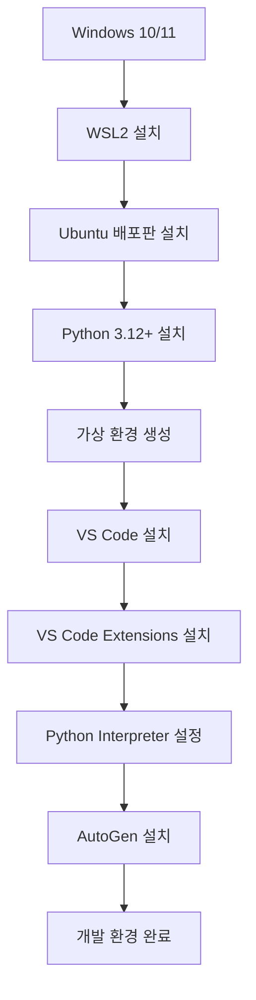

### 1.2 WSL2 및 Ubuntu 배포판 설치

#### PowerShell 관리자 권한으로 실행
```powershell
# WSL (Windows Subsystem for Linux) 기능 활성화
dism.exe /online /enable-feature /featurename:Microsoft-Windows-Subsystem-Linux /all /norestart

# 가상 머신 플랫폼 기능 활성화
dism.exe /online /enable-feature /featurename:VirtualMachineExtension /all /norestart

# Ubuntu 설치
wsl --install -d Ubuntu-24.04
# Windows 설치
#Microsoft Store 실행
#시작 메뉴에서 "Ubuntu-24.04" 검색 및 설치

# WSL2를 기본값으로 설정
wsl --set-default-version 2
```

#### 설치 확인
```bash
# WSL 버전 확인
wsl --list --verbose

# Ubuntu 버전 확인
lsb_release -a
```

### 1.3 Python 설치

#### Ubuntu에서 Python 설치

```bash
# 시스템 업데이트
sudo apt update && sudo apt upgrade -y

# Python 및 관련 패키지 설치
sudo apt install python python-pip python-venv python-dev -y

# python3 --> python
sudo apt install python-is-python3

# Python 버전 확인
python --version

# pip 업그레이드
python -m pip install --upgrade pip
```

#### Window에서 Python  설치

```bash
#Microsoft Store 실행
#시작 메뉴에서 "Microsoft Store" 검색 및 실행
#"Python"을 검색하여 3.12 이상 설치

# Python 버전 확인
python --version

# pip 업그레이드
python -m pip install --upgrade pip
```


### 1.4 Python 가상 환경 생성

#### 가상 환경 설정(Linux)
```bash
# 프로젝트 디렉토리 생성
mkdir ~/autogen-project
cd ~/autogen-project

# 가상 환경 생성
python -m venv autogen-venv

# 가상 환경 활성화
source autogen-venv/bin/activate

# 가상 환경 활성화 확인 (프롬프트에 (autogen-env) 표시됨)
```
#### 가상 환경 설정(Windows)
```bash
# 프로젝트 디렉토리 생성
mkdir ~/autogen-project
cd ~/autogen-project

# 가상 환경 생성
python -m venv autogen-venv

# 가상 환경 권한(PowerShell)
Set-ExecutionPolicy -ExecutionPolicy RemoteSigned -Scope CurrentUser

# 가상 환경 활성화(PowerShell)
.\autogen-venv\Scripts\activate.ps1
# 가상 환경 활성화(Command)
.\autogen-venv\Scripts\activate.bat

# 가상 환경 활성화 확인 (프롬프트에 (autogen-venv) 표시됨)
```

#### 필수 라이브러리 설치

```bash
pip-system-certs

ag2[openai]
chromadb
sentence_transformers
numpy

mcp
fastmcp
autogen-ext[openai,mcp]
autogen_agentchat

asyncio
python-dotenv

fastapi
uvicorn 
jinja2
```

### 1.5 VS Code 설치

#### VS Code 설치 (Windows)
1. [VS Code 공식 사이트](https://code.visualstudio.com/)에서 다운로드
2. 설치 시 "Add to PATH" 옵션 체크

#### 필수 Extensions 설치

VS Code Extention 내 아래 모듈 설치

```bat
Python
WSL #WSL환경일 경우 설치
```

#### WSL에서 VS Code 실행
```bash
# WSL Ubuntu에서 VS Code 실행
cd ~/autogen-project
code .
```

#### VS Code 에서 Python Interpreter 설정
1. `Ctrl + Shift + P` 눌러 명령 팔레트 열기
2. "Python: Select Interpreter" 검색 후 선택
3. `~/autogen-project/autogen-venv/bin/python` 선택


## 2. LLM(Large Lanaguage Model) 이해

LLM은 Transformer 아키텍처를 기반으로 한 딥러닝 모델로, 방대한 텍스트 데이터를 학습하여 인간의 언어를 이해하고 생성하는 인공지능이다. 


### 2.1 LLM 기본 개념

| 항목            | 설명                                                         | 예시                                                 |
| :-------------- | :----------------------------------------------------------- | :--------------------------------------------------- |
| **정의**        | 대량의 텍스트 데이터로 학습된 인공지능 모델로, 자연어를 이해하고 생성하는 시스템 | GPT-4, Claude, Gemini 등                             |
| **핵심 원리**   | 주어진 텍스트의 다음에 올 가능성이 높은 단어나 문장을 예측하는 확률적 모델 | "오늘 날씨가" 다음에 "좋다", "나쁘다" 등의 확률 계산 |
| **학습 데이터** | 인터넷 텍스트, 책, 논문, 웹페이지 등 방대한 양의 문서        | 수십 테라바이트 규모의 텍스트 데이터                 |
| **매개변수**    | 모델이 학습한 지식이 저장된 수치들                           | GPT-3는 1750억 개, GPT-4는 추정 1조 개 이상          |


### 2.2 주요 LLM 비교

| 모델                                                         | 제공사                                                       | 공개/업데이트                                                | 파라미터                                                     | 컨텍스트                                                     | 모달리티                                                     | 라이선스/오픈                                                | 접근/배포                                                    |
| :----------------------------------------------------------- | :----------------------------------------------------------- | :----------------------------------------------------------- | :----------------------------------------------------------- | :----------------------------------------------------------- | :----------------------------------------------------------- | :----------------------------------------------------------- | :----------------------------------------------------------- |
| GPT‑4o [openai](https://openai.com/index/hello-gpt-4o/)      | OpenAI [openai](https://openai.com/index/hello-gpt-4o/)      | 2024‑05 [openai](https://openai.com/index/hello-gpt-4o/)     | 비공개 [platform.openai](https://platform.openai.com/docs/models/gpt-4o) | 128K tokens [wikipedia](https://en.wikipedia.org/wiki/GPT-4o) | 텍스트·음성·비전 [openai](https://openai.com/index/hello-gpt-4o/) | 상용 API(폐쇄형) [platform.openai](https://platform.openai.com/docs/models/gpt-4o) | OpenAI API·Azure OpenAI [platform.openai](https://platform.openai.com/docs/models/gpt-4o) |
| Claude 3.5 Sonnet [anthropic](https://www.anthropic.com/news/claude-3-5-sonnet) | Anthropic [anthropic](https://www.anthropic.com/news/claude-3-5-sonnet) | 2024‑06‑20 [anthropic](https://www.anthropic.com/news/claude-3-5-sonnet) | 비공개 [anthropic](https://www.anthropic.com/news/claude-3-5-sonnet) | 200K tokens [anthropic](https://www.anthropic.com/news/claude-3-5-sonnet) | 텍스트(+비전 지원) [anthropic](https://www.anthropic.com/news/claude-3-5-sonnet) | 상용 API(폐쇄형) [anthropic](https://www.anthropic.com/news/claude-3-5-sonnet) | Anthropic API·Bedrock·Vertex AI [anthropic](https://www.anthropic.com/news/claude-3-5-sonnet) |
| Gemini 1.5 Pro [developers.googleblog](https://developers.googleblog.com/en/new-features-for-the-gemini-api-and-google-ai-studio/) | Google [developers.googleblog](https://developers.googleblog.com/en/new-features-for-the-gemini-api-and-google-ai-studio/) | 2024‑06‑26 [developers.googleblog](https://developers.googleblog.com/en/new-features-for-the-gemini-api-and-google-ai-studio/) | 비공개 [developers.googleblog](https://developers.googleblog.com/en/new-features-for-the-gemini-api-and-google-ai-studio/) | 2M tokens [developers.googleblog](https://developers.googleblog.com/en/new-features-for-the-gemini-api-and-google-ai-studio/) | 멀티모달(코드 실행·캐싱) [developers.googleblog](https://developers.googleblog.com/en/new-features-for-the-gemini-api-and-google-ai-studio/) | 상용 API(폐쇄형) [developers.googleblog](https://developers.googleblog.com/en/new-features-for-the-gemini-api-and-google-ai-studio/) | Gemini API·AI Studio [developers.googleblog](https://developers.googleblog.com/en/new-features-for-the-gemini-api-and-google-ai-studio/) |
| Llama 3.1 405B [meta](https://ai.meta.com/blog/meta-llama-3-1/) | Meta [meta](https://ai.meta.com/blog/meta-llama-3-1/)        | 2024‑07‑22 [meta](https://ai.meta.com/blog/meta-llama-3-1/)  | 405B [huggingface](https://huggingface.co/meta-llama/Llama-3.1-405B) | 128K tokens [techcrunch](https://techcrunch.com/2024/07/23/meta-releases-its-biggest-open-ai-model-yet/) | 텍스트 [meta](https://ai.meta.com/blog/meta-llama-3-1/)      | Llama Community(오픈 가용) [huggingface](https://huggingface.co/meta-llama/Llama-3.1-405B) | 다운로드/HF 배포 [huggingface](https://huggingface.co/meta-llama/Llama-3.1-405B) |
| Mistral Large 2 [mistral](https://mistral.ai/news/mistral-large-2407) | Mistral AI [mistral](https://mistral.ai/news/mistral-large-2407) | 2025‑01‑16 [mistral](https://mistral.ai/news/mistral-large-2407) | 비공개 [mistral](https://mistral.ai/news/mistral-large-2407) | 128K tokens [mistral](https://mistral.ai/news/mistral-large-2407) | 텍스트 [mistral](https://mistral.ai/news/mistral-large-2407) | 상용 제공 [mistral](https://mistral.ai/news/mistral-large-2407) | Mistral API·클라우드 파트너 [mistral](https://mistral.ai/news/mistral-large-2407) |
| Mixtral 8x22B [promptingguide](https://www.promptingguide.ai/models/mixtral-8x22b) | Mistral AI [promptingguide](https://www.promptingguide.ai/models/mixtral-8x22b) | 2024‑04(계열) [promptingguide](https://www.promptingguide.ai/models/mixtral-8x22b) | MoE 총 141B/활성 39B [promptingguide](https://www.promptingguide.ai/models/mixtral-8x22b) | 64K tokens [promptingguide](https://www.promptingguide.ai/models/mixtral-8x22b) | 텍스트 [promptingguide](https://www.promptingguide.ai/models/mixtral-8x22b) | Apache‑2.0 [promptingguide](https://www.promptingguide.ai/models/mixtral-8x22b) | 오픈 가중치/HF 등 [promptingguide](https://www.promptingguide.ai/models/mixtral-8x22b) |
| Command R+ [cohere](https://docs.cohere.com/docs/command-r-plus) | Cohere [cohere](https://docs.cohere.com/docs/command-r-plus) | 2024년 도입 [blogs.oracle](https://blogs.oracle.com/ai-and-datascience/post/announcing-the-latest-features-oci-generative-ai) | 비공개 [cohere](https://docs.cohere.com/docs/command-r-plus) | 128K tokens [blogs.oracle](https://blogs.oracle.com/ai-and-datascience/post/announcing-the-latest-features-oci-generative-ai) | 텍스트 [cohere](https://docs.cohere.com/docs/command-r-plus) | 상용 API [cohere](https://docs.cohere.com/docs/command-r-plus) | Cohere API·OCI GenAI [cohere+1](https://docs.cohere.com/docs/command-r-plus) |
| Grok‑2 [docsbot](https://docsbot.ai/models/grok-2)           | xAI [docsbot](https://docsbot.ai/models/grok-2)              | 2024‑08‑12 [docsbot](https://docsbot.ai/models/grok-2)       | 비공개 [docsbot](https://docsbot.ai/models/grok-2)           | 약 131K tokens [vals](https://www.vals.ai/models/grok_grok-2-1212) | 텍스트·비전 [docsbot](https://docsbot.ai/models/grok-2)      | 상용 API [docsbot](https://docsbot.ai/models/grok-2)         | xAI API·X 플랫폼 [docsbot](https://docsbot.ai/models/grok-2) |
| DeepSeek‑V3 [helicone](https://www.helicone.ai/blog/deepseek-v3) | DeepSeek [helicone](https://www.helicone.ai/blog/deepseek-v3) | 2025‑01‑21(배포) [helicone](https://www.helicone.ai/blog/deepseek-v3) | MoE 총 671B/활성 ≈37B [helicone+1](https://www.helicone.ai/blog/deepseek-v3) | 128K tokens [helicone](https://www.helicone.ai/blog/deepseek-v3) | 텍스트 [helicone](https://www.helicone.ai/blog/deepseek-v3)  | 오픈 배포 [helicone](https://www.helicone.ai/blog/deepseek-v3) | 공개 리포지토리/플랫폼 [helicone](https://www.helicone.ai/blog/deepseek-v3) |
| Qwen2.5‑72B [huggingface](https://huggingface.co/Qwen/Qwen2.5-72B) | Alibaba Qwen [qwenlm.github](https://qwenlm.github.io/blog/qwen2.5/) | 2024‑09‑18(라인 공개) [qwenlm.github](https://qwenlm.github.io/blog/qwen2.5/) | 72.7B(비임베딩 70B) [huggingface+1](https://huggingface.co/Qwen/Qwen2.5-72B) | 131,072 tokens [huggingface](https://huggingface.co/Qwen/Qwen2.5-72B) | 텍스트(동일 라인 VL 별도) [modelscope](https://modelscope.cn/models/Qwen/Qwen2.5-VL-72B-Instruct) | 오픈 가중치 [huggingface](https://huggingface.co/Qwen/Qwen2.5-72B) | HF/ModelScope 배포 [huggingface+1](https://huggingface.co/Qwen/Qwen2.5-72B) |
| Phi‑3 Mini/Small/Medium [arxiv](https://arxiv.org/abs/2404.14219) | Microsoft [arxiv](https://arxiv.org/abs/2404.14219)          | 2024‑04‑21(논문) [arxiv](https://arxiv.org/abs/2404.14219)   | 3.8B/7B/14B [arxiv+2](https://arxiv.org/abs/2404.14219)      | 4K~128K(변형별) [huggingface](https://huggingface.co/microsoft/Phi-3-mini-4k-instruct) | 텍스트(비전 변형 별도) [arxiv](https://arxiv.org/abs/2404.14219) | 오픈 가중치 [huggingface](https://huggingface.co/microsoft/Phi-3-mini-4k-instruct) | HF·Azure AI Studio [huggingface](https://huggingface.co/microsoft/Phi-3-mini-4k-instruct) |
| Yi‑1.5 34B [openlaboratory](https://openlaboratory.ai/models/yi-1_5-34b) | 01.AI [openlaboratory](https://openlaboratory.ai/models/yi-1_5-34b) | 2024‑05 [openlaboratory](https://openlaboratory.ai/models/yi-1_5-34b) | 34.4B [openlaboratory](https://openlaboratory.ai/models/yi-1_5-34b) | 최대 200K(변형별) [openlaboratory](https://openlaboratory.ai/models/yi-1_5-34b) | 텍스트(비전 확장 있음) [openlaboratory](https://openlaboratory.ai/models/yi-1_5-34b) | 오픈 가중치 [github](https://github.com/01-ai/Yi)            | GitHub/HF 배포 [github](https://github.com/01-ai/Yi)         |
| GLM‑4‑32B [github](https://github.com/zai-org/GLM-4)         | Zhipu/Z.ai [github](https://github.com/zai-org/GLM-4)        | 2024‑05‑14(계열) [github](https://github.com/zai-org/GLM-4)  | 32B [github+1](https://github.com/zai-org/GLM-4)             | 문서 미기재(모델별 상이) [huggingface](https://huggingface.co/docs/transformers/model_doc/glm4) | 텍스트(다국어) [huggingface](https://huggingface.co/docs/transformers/model_doc/glm4) | 오픈 가중치 가용(모델별) [huggingface](https://huggingface.co/docs/transformers/model_doc/glm4) | HF·로컬 배포 문서 [huggingface](https://huggingface.co/docs/transformers/model_doc/glm4) |


### 2.3 LLM 학습 과정

| 단계                   | 과정                                 | 상세 설명                                          |
| :--------------------- | :----------------------------------- | :------------------------------------------------- |
| **1단계: 사전 훈련**   | 대량의 텍스트로 기본 언어 능력 학습  | 문법, 어휘, 일반 상식을 무감독 학습으로 획득       |
| **2단계: 지시 조정**   | 인간의 지시를 따르도록 훈련          | "요약해줘", "번역해줘" 같은 명령을 이해하도록 학습 |
| **3단계: 인간 피드백** | 인간 평가자의 선호도를 반영하여 조정 | 유해하거나 부정확한 답변을 피하도록 미세 조정      |
| **4단계: 최종 검증**   | 안전성과 성능을 종합적으로 테스트    | 다양한 태스크에서 품질 검증 후 배포                |


### 2.4 LLM 주요 원리

| 구성 요소           | 역할                                       | 동작 방식                                               |
| :------------------ | :----------------------------------------- | :------------------------------------------------------ |
| **토크나이저**  | 텍스트를 모델이 이해할 수 있는 숫자로 변환 | "안녕하세요" → [1234][5678][9012]                       |
| **어텐션 메커니즘** | 문맥에서 중요한 부분에 집중                | "그"가 앞선 문장의 "철수"를 가리킨다고 판단             |
| **트랜스포머**  | 입력 전체를 동시에 처리하는 신경망 구조    | 문장의 모든 단어 관계를 병렬로 분석                     |
| **확률 분포**       | 다음에 올 단어의 가능성을 확률로 계산      | "사과는" 다음에 "달다"(70%), "빨갛다"(20%), "크다"(10%) |


### 2.5 LLM 작동 흐름

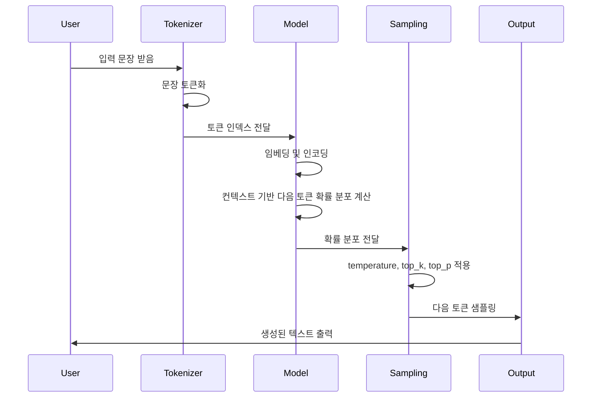

| 단계                               | 역할 및 기능                                     | 상세 설명                                                    |
| :--------------------------------- | :----------------------------------------------- | :----------------------------------------------------------- |
| 입력 수신 (User→Tokenizer)         | 사용자의 문장 입력 수신                          | 사용자가 작성한 자연어 문장을 입력받음                       |
| 토큰화 (Tokenizer)                 | 문장을 토큰 단위로 분할                          | 문장을 의미있는 토큰(단어 또는 부분 단어)로 분할             |
| 토큰 인덱스 변환 (Tokenizer→Model) | 토큰을 숫자 인덱스 형태로 변환                   | 모델에서 이해 가능한 정수 인덱스 시퀀스로 변경               |
| 임베딩 및 인코딩 (Model)           | 인덱스를 벡터로 임베딩하고, 문맥을 반영해 인코딩 | 각 토큰을 고차원 벡터로 변환하고 Transformer 계층으로 인코딩 |
| 확률 분포 계산 (Model)             | 다음 토큰별 확률 분포 계산                       | 문맥에 맞는 다음 토큰의 확률 분포를 소프트맥스 함수로 산출   |
| 샘플링 (Sampling)                  | temperature, top_k, top_p 적용 후 출력 토큰 선택 | 확률 분포 조절 및 후보 제한을 통해 적절한 다음 토큰 샘플링 수행 |
| 출력 (Output→User)                 | 최종 생성 텍스트를 사용자에게 반환               | 샘플링된 토큰을 텍스트로 변환해 사용자에게 전달              |


### 2.6 샘플링

샘플링은 모델 출력의 다양성과 창의성을 조절하는 핵심 과정

- **주요 속성**

| 용어                     | 역할 및 의미                            | 설명                                                         | 효과 및 특징                                                 |
| :----------------------- | :-------------------------------------- | :----------------------------------------------------------- | :----------------------------------------------------------- |
| Temperature (온도)       | 출력 확률 분포의 '뾰족함' 조절          | 확률을 조절해 확실한 토큰 선택과 다양성 균형을 맞춤. 0에 가까우면 가장 확률 높은 토큰만 선택, 클수록 랜덤성 증가 | 낮으면 예측 결과가 보수적·일관적, 높으면 다양하고 창의적 결과 생성 |
| Top_k                    | 다음 토큰 후보를 상위 k개로 제한        | 확률 높은 상위 k개의 토큰만 후보로 삼아 그중 하나를 선택     | k가 작으면 단조로운 결과, 크면 다양성 증가하나 품질 저하 가능성 존재 |
| Top_p (Nucleus Sampling) | 누적 확률 p 이하인 토큰 집합에서 샘플링 | 토큰 확률을 내림차순 정렬 후 누적 확률 p까지 후보 집합을 만듦 | 균형 잡힌 다양성 조절, 일반적으로 Top_k보다 더 자연스러운 결과 유도 |

- **처리 과정**

| 단계                  | 상세 설명                                                    |
| :-------------------- | :----------------------------------------------------------- |
| 확률 분포 수신        | 모델이 현재 문맥을 바탕으로 소프트맥스 함수를 통해 다음 토큰 후보들의 확률 분포를 계산해 전달받음 |
| 확률 분포 조절        | Temperature 파라미터를 사용해 확률 분포를 평평하거나 뾰족하게 조절하여 다양성과 확실성 간 균형을 맞춤 |
| 후보 토큰 집합 제한   | Top_k (상위 K개 후보만), Top_p (누적 확률 P 이하 후보 집합만) 등의 기법으로 샘플링 후보 토큰 범위를 동적으로 제한 |
| 토큰 샘플링 또는 선택 | 제한된 후보군 중에서 무작위 샘플링을 하거나 확률이 가장 높은 토큰을 선택해 다음 토큰으로 결정 |
| 반복 및 업데이트      | 선택된 토큰을 출력에 추가하고, 이를 문맥에 포함하여 다음 샘플링 단계에 활용하는 과정을 반복 |


### 2.7 LLM의 한계

#### 2.7.1 Attention Decay (망각 현상)

- **LLM이 긴 컨텍스트에서 초기 정보나 중간 정보를 점진적으로 "잊어버리는" 현상**입니다. 
- 대화나 문서가 길어질수록 앞부분의 정보에 대한 주의(attention) 가중치가 감소하여 정보가 손실됩니다.

```python
# 간단한 예시로 이해하기
conversation = [
    "안녕하세요, 저는 김철수입니다.",  # 초기 정보
    "오늘 날씨가 좋네요.",
    "점심 메뉴 추천해주세요.",
    # ... 많은 대화 내용
    "제 이름이 뭐라고 했죠?"  # 초기 정보를 물어봄
]
# LLM이 "김철수"를 기억하지 못할 가능성 증가
```

- **주요 원인**

  - **컨텍스트 길이 제한**: 토큰 수 제한으로 인한 정보 손실

  - **Position Encoding 한계**: 위치 정보 처리의 한계

  - **Attention 메커니즘 특성**: 최근 정보에 더 높은 가중치

  - **메모리 압축**: 긴 시퀀스를 처리하기 위한 정보 압축

- **해결방법**

  - **Context Window 확장**: Sliding Window, 계층적 요약

  - **External Memory**: Vector DB, Knowledge Graph를 통한 중요 정보 별도 저장

  - **맥락 압축**: 중요도 기반 선택적 요약, 단계별 메모리 관리

  - **프롬프트 엔지니어링**: 핵심 정보 재주입, 체크포인트 시스템

  

#### 2.7.2 Hallucination (환각 현상)

- **LLM이 사실과 다르거나 존재하지 않는 정보를 마치 사실인 것처럼 생성하는 현상**입니다. 

- 모델이 확신을 가지고 잘못된 정보를 제공하는 것이 특징입니다.

- **발생 유형**

  - 사실적 환각 (Factual Hallucination)

    ```python
    # 예시
    질문: "KT의 CEO가 누구인가요?"
    잘못된 답변: "KT의 현재 CEO는 이철수입니다." 
    # 실제와 다른 인물명을 확신있게 제시
    ```

  - 논리적 환각 (Logical Hallucination)

    ```python
    # 예시
    질문: "Python에서 문자열을 정수로 변환하는 방법"
    잘못된 답변: "string.to_integer() 메소드를 사용하세요"
    # 존재하지 않는 메소드를 제시
    ```

  - 맥락적 환각 (Contextual Hallucination)

    ```python
    # 예시
    문서: "이 API는 GET 방식만 지원합니다"
    질문: "POST 요청은 어떻게 보내나요?"
    잘못된 답변: "다음과 같이 POST 요청을 보낼 수 있습니다..."
    # 문서 내용과 모순되는 답변 제공
    ```

- **발생 원인**

  - **학습 데이터의 한계**

    - **불완전한 정보**: 부분적이거나 오래된 정보

    - **모순된 정보**: 서로 다른 소스의 상충하는 내용

    - **편향된 데이터**: 특정 관점에 치우친 정보

    - **모델 구조적 한계**

      - **확률적 생성**: 가장 확률이 높은 토큰을 선택하는 방식

      - **지식 압축**: 방대한 정보를 매개변수로 압축하면서 발생하는 손실

      - **일반화 오류**: 학습하지 않은 상황에서 잘못된 유추
  - **프롬프트 설계 문제**
    - **애매한 질문**: 명확하지 않은 요청
      - **과도한 창의성 요구**: 사실보다 창의성을 우선시하도록 유도

- **해결방법**

  - **Ground Truth 검증**: 실시간 사실 확인, 신뢰도 점수 시스템

  - **Multi-Agent 검증**: 전문가 Agent 구성, 토론 기반 검증

  - **불확실성 명시**: 신뢰도에 따른 표현 조정, 출처 추적

  - **피드백 루프**: 사용자 피드백 학습, A/B 테스팅 기반 개선


## 3. 프롬프트  이해

- 프롬프트(Prompt)는 AI 모델에게 특정 작업을 수행하도록 지시하는 텍스트.

- 효과적인 프롬프트는 AI의 성능을 극대화하고 원하는 결과를 얻는 핵심 요소


### 3.1 프롬프트의 정의와 역할

| 개념                | 설명                                          | 예시                                                         |
| :------------------ | :-------------------------------------------- | :----------------------------------------------------------- |
| **시스템 프롬프트** | LLM의 역할과 행동 방식을 정의하는 기본 설정   | "당신은 전문 번역가입니다. 정확하고 자연스러운 번역을 제공하세요." |
| **사용자 프롬프트** | 실제 사용자가 입력하는 구체적인 요청이나 질문 | "이 계약서의 주요 내용을 3줄로 요약해줘"                     |
| **컨텍스트**        | 이전 대화나 추가 정보를 포함하는 문맥         | 이전 대화 내용 + 현재 질문                                   |

- **프롬프트 VS 컨텍스트**

  | 구분        | 컨텍스트 (Context)                                    | 프롬프트 (Prompt)                      |
  | :---------- | :---------------------------------------------------- | :------------------------------------- |
  | 핵심 의미   | 작업을 둘러싼 배경/환경(규칙, 데이터, 도구, 히스토리) | 모델에 내리는 구체적 지시/요청 문장    |
  | 범위·지속성 | 시스템/세션 전반, 다중 턴·장기 지속                   | 단일 요청 중심, 대개 일회성            |
  | 목적        | 이해력·일관성·정책 준수 강화                          | 원하는 형식·내용의 즉시 출력 유도      |
  | 전형 예시   | 정책 요약, 용어집, 사용자 프로필, RAG 결과, 툴 사용법 | “아래 텍스트를 JSON 스키마로 요약해줘” |
  | 실패 패턴   | 정보 과잉/누락, 최신성·권한 문제                      | 모호한 지시, 출력 스키마 미제시        |


### 3.2 프롬프트 엔지니어링의 중요성

| 측면          | 중요성                                 | 실제 효과                               |
| :------------ | :------------------------------------- | :-------------------------------------- |
| **정확성**    | 원하는 결과를 얻기 위한 필수 요소      | 모호한 질문 → 부정확한 답변             |
| **효율성**    | 시행착오 없이 한 번에 원하는 결과 획득 | 명확한 프롬프트 → 즉시 사용 가능한 결과 |
| **비용 절약** | API 사용료 및 시간 비용 절감           | 재질문 횟수 감소 → 토큰 사용량 절약     |
| **품질 향상** | 일관되고 높은 품질의 출력 보장         | 체계적 프롬프트 → 안정적인 성능         |


### 3.3 프롬프트가 출력에 미치는 영향

| 프롬프트 요소     | 출력에 미치는 영향                | 예시 비교                             |
| :---------------- | :-------------------------------- | :------------------------------------ |
| **명령어 스타일** | 응답의 형식과 구조 결정           | "설명해줘" vs "5개 항목으로 정리해줘" |
| **톤앤매너**  | 응답의 어조와 격식 수준           | "친근하게 설명" vs "전문적으로 설명"  |
| **예시 제공**     | 원하는 출력 형태 유도             | 예시 없음 vs 구체적 예시 제공         |
| **제약 조건**     | 답변의 길이, 형식, 내용 범위 제한 | "100자 이내로" vs "자세히"            |


### 3.4 프롬프트 결과 품질 관계

잘 만든 프롬프트는 모델의 토큰 출력 확률분포를 특정 의미 중심으로 집중시켜 결과 품질을 높이는 역할을 한다.

| 내용                    | 설명                       | 영향 및 결과                                                |
| :---------------------- | :------------------------- | :---------------------------------------------------------- |
| 명확·구체적 프롬프트    | 확률분포 집중 및 편향      | 중요·관련 단어 생성 확률 상승, 불필요 단어 확률 하락        |
| 확률분포 편중 효과      | 결과의 일관성 및 품질 향상 | 출력이 명확하고 예측 가능해짐                               |
| 모호·불명확 프롬프트    | 확률분포 확산              | 다양한 결과 가능성 열림, 산만하거나 예측 불가능한 결과 발생 |
| 구체적 정보 포함 중요성 | 예시, 질문 의도 등 포함 시 | 다음 단어 예측 확률에 큰 영향으로 품질 개선                 |


### 3.5 프롬프트 작성 기본 원칙

| 원칙          | 설명                             | 좋은 예시                                                 | 나쁜 예시            |
| :------------ | :------------------------------- | :-------------------------------------------------------- | :------------------- |
| **명확성**    | 모호함 없이 구체적으로 지시      | "2023년 한국 경제성장률을 퍼센트로 알려줘"                | "경제 상황 알려줘"   |
| **구체성**    | 원하는 형식과 내용을 상세히 명시 | "다음 조건으로 이메일 작성: 격식체, 3문단, 감사인사 포함" | "이메일 써줘"        |
| **순차성**    | 복잡한 작업을 단계별로 분해      | "1단계: 요약, 2단계: 분석, 3단계: 결론"                   | "이 보고서 분석해줘" |
| **맥락 제공** | 필요한 배경 정보를 충분히 제공   | "IT 스타트업 CEO에게 보내는 제안서..."                    | "제안서 써줘"        |


### 3.6 프롬프트 작성 형태

프롬프트는 Markdown 문법으로 작성한다.

| 장점               | 설명                                                         | 참고 내용 및 예시                                            |
| :----------------- | :----------------------------------------------------------- | :----------------------------------------------------------- |
| 명확한 구조화      | 제목, 리스트, 굵은 글씨 등 마크다운의 다양한 문법으로 프롬프트를 계층적이고 명확하게 구성 가능 | "## 지시문", "- 항목1", "**중요**" 등으로 구분하여 AI가 각 부분을 명확히 인식 가능 |
| 가독성 향상        | 사람과 AI 모두 읽기 쉬운 형태로 프롬프트 작성 가능           | 기본 텍스트 대비 가독성이 높아 작성 및 수정 시 편리함        |
| 컨텍스트 신호 제공 | 코드 블록, 인용구 등 특수 형식 사용으로 AI가 문맥, 코드, 예시 구분 등 정보를 정확히 파악 가능 | "`python\nprint('Hello')\n`                                  |
| 출력 포맷과 연계   | 많은 AI 모델이 답변을 마크다운으로 출력하므로 입력과 출력의 일관성을 유지하며 후처리 과정이 편리 | 목록, 표, 링크 등의 형식이 바로 적용 가능                    |
| 경량화된 토큰 사용 | 복잡한 태그 언어보다 가볍고 간결하여 토큰 수가 적게 들며, 입력 길이 제한 내에서 더 많은 정보를 전달할 수 있음 | XML 등에 비해 간단한 구조로 토큰 수 절감                     |
| 유지 보수 용이     | 텍스트 파일 형태로 쉽게 편집, 관리하며 다양한 도구와 호환 가능 | 마크다운 편집기는 무료 및 오픈소스로 다양하게 존재           |
| 한계점             | 엄격한 구조 강제 불가, 복잡한 스키마 표현 어려움             | 복잡한 데이터나 엄격한 문법이 필요할 때는 XML, JSON, YAML 등이 더 적합 |


### 3.7 프롬프트 구조

#### 프롬프트 기본 템플릿

```
[역할 정의] + [작업 컨텍스트] + [작업 목표] + [구체적 요구사항] + [제약 조건] + [출력 형식]
```

#### 프롬프트 구성 요소

- **역할 정의 (Role Definition)**

```markdown
# 당신은 숙련된 백엔드 개발자로서 다음 특성을 가지고 있습니다:
- Java Spring Framework 전문가
- Python FastAPI/Django 경험자
- MSA 아키텍처 설계 능력
- AI Agent 기반 자동화 도구 개발 경험
```

- **작업 컨텍스트 (Context)**

```markdown
# 현재 상황
- KT 통신 서비스 백엔드 시스템 개발
- 마이크로서비스 아키텍처 환경
- AI Agent를 활용한 코드 자동 생성 도구 개발 중
- MS Autogen 프레임워크 기반 시스템 구축
```

- **구체적 요구사항 (Specific Requirements)**

```markdown
# 요구사항
## 기능 요구사항
- [기능 1]: 구체적 설명
- [기능 2]: 구체적 설명

## 기술 요구사항
- Java 17 이상
- Spring Boot 3.x
- JPA/Hibernate
- JWT 인증
- Docker 컨테이너화

## 품질 요구사항
- 단위 테스트 커버리지 80% 이상
- API 응답 시간 200ms 이내
- 보안 취약점 제로
```

- **제약 조건 (Constraints)**

```markdown
# 제약 조건
- 기존 시스템과의 호환성 유지
- 사내 코딩 컨벤션 준수
- 특정 라이브러리 사용 금지
- 메모리 사용량 제한
```

- **출력 형식 (Output Format)**

```markdown
# 출력 형식
다음 형식으로 결과를 제공해주세요:
1. 코드 구현
2. 단위 테스트 코드
3. API 문서 (OpenAPI 3.0)
4. 실행 방법
5. 주요 고려사항
```


### 3.8 프롬프트 최적화 전략

| 전략                  | 목적                       | 실행 방법                            | 효과 측정                 |
| :-------------------- | :------------------------- | :----------------------------------- | :------------------------ |
| **반복 테스트**       | 최적의 표현 방식 발견      | 동일한 의도로 다양한 표현 시도       | 출력 품질과 일관성 비교   |
| **점진적 개선**       | 단계적으로 프롬프트 정교화 | 기본 → 세부사항 추가 → 최종 조정     | 각 단계별 개선 효과 확인  |
| **네거티브 프롬프트** | 원하지 않는 결과 방지      | "~하지 마세요", "~는 제외하고"       | 부적절한 출력 감소율      |
| **템플릿화**          | 재사용 가능한 형식 구축    | 자주 사용하는 패턴을 템플릿으로 저장 | 작업 효율성과 일관성 향상 |


### 3.9 도메인별 프롬프트 작성 가이드

| 도메인          | 특징                 | 권장 접근법                              | 주의사항                               |
| :-------------- | :------------------- | :--------------------------------------- | :------------------------------------- |
| **창작/콘텐츠** | 창의성과 독창성 중요 | 자유로운 표현 허용, 다양한 아이디어 요청 | 저작권 침해 방지, 윤리적 내용 확인     |
| **분석/데이터** | 정확성과 논리성 필수 | 단계별 분석 과정 요구, 근거 제시         | 데이터 출처 확인, 추론 과정 검증       |
| **번역/언어**   | 문맥과 뉘앙스 보존   | 대상 독자와 목적 명시                    | 문화적 차이 고려, 전문용어 처리        |
| **코딩/기술**   | 실행 가능성과 효율성 | 요구사항 상세 명세, 제약조건 명시        | 보안 취약점 확인, 베스트 프랙티스 준수 |


### 3.10 피해야 할 프롬프트 패턴

| 잘못된 패턴       | 문제점             | 개선 방법                     | 예시                                                |
| :---------------- | :----------------- | :---------------------------- | :-------------------------------------------------- |
| **모호한 지시**   | 의도 파악 어려움   | 구체적이고 명확한 표현 사용   | ❌ "좋게 써줘" → ✅ "긍정적이고 격려하는 톤으로 작성" |
| **과도한 복잡성** | 처리 능력 초과     | 단순하게 분해하여 단계별 진행 | ❌ 10개 작업 동시 요청 → ✅ 우선순위별로 순차 진행    |
| **편향된 전제**   | 부정확한 결과 유도 | 중립적이고 객관적인 표현      | ❌ "A가 B보다 우월한 이유" → ✅ "A와 B의 차이점 비교" |
| **불완전한 정보** | 추측에 의존한 답변 | 필요한 모든 컨텍스트 제공     | ❌ 배경 정보 생략 → ✅ 상황 설명 포함                 |


### 3.11 프롬프트 예시

#### Java Spring Boot API 개발
```markdown
# 역할
당신은 Java Spring Boot 전문 개발자입니다.

# 작업
통신사 고객 관리 시스템의 고객 정보 관리 API를 개발해주세요.

# 요구사항
## 기술 스택
- Java 17
- Spring Boot 3.1
- Spring Data JPA
- H2 Database (개발용)
- Maven

## 기능
1. 고객 등록 (POST /api/customers)
2. 고객 조회 (GET /api/customers/{id})
3. 고객 목록 조회 (GET /api/customers)
4. 고객 정보 수정 (PUT /api/customers/{id})
5. 고객 삭제 (DELETE /api/customers/{id})

## 고객 정보 필드
- id (Long, 자동 생성)
- name (String, 필수)
- phoneNumber (String, 필수, 유니크)
- email (String, 선택)
- address (String, 선택)
- createdAt (LocalDateTime)
- updatedAt (LocalDateTime)

# 제약 조건
- RESTful API 원칙 준수
- 입력 데이터 검증 필수
- 예외 처리 포함
- 적절한 HTTP 상태 코드 반환

# 출력
1. Entity 클래스
2. Repository 인터페이스
3. Service 클래스
4. Controller 클래스
5. DTO 클래스
6. 단위 테스트 코드
```


### 3.11 프롬프트 최적화 기법

#### Few-Shot Learning(**소량 샘플 학습**)

- **최소한의 예시(보통 1-10개)를 통해 AI 모델이 새로운 작업을 수행할 수 있도록 하는 학습 방법**입니다. 
- 전통적인 머신러닝처럼 대량의 데이터로 재학습하지 않고, 프롬프트 내에서 예시를 제공하여 패턴을 학습시킵니다.
- **고려사항**
  - **예시의 품질**: 대표적이고 명확한 예시를 선택해야 함
  - **예시의 다양성**: 다양한 케이스를 포함하되 일관된 패턴 유지
  - **순서의 영향**: 예시의 순서가 결과에 영향을 줄 수 있음
  - **토큰 제한**: 많은 예시로 인한 컨텍스트 길이 증가
- **장점**
  - **빠른 적응**: 새로운 도메인에 즉시 적용 가능
  - **데이터 효율성**: 대량의 학습 데이터 불필요
  - **유연성**: 다양한 작업에 동일한 모델 활용
  - **비용 효율성**: 별도 파인튜닝 불필요
- **단점**
  - **일관성 부족**: 복잡한 작업에서 성능 편차 발생
  - **예시 의존성**: 잘못된 예시가 전체 성능에 악영향
  - **확장성 한계**: 매우 복잡한 작업에는 한계 존재
  - **컨텍스트 제한**: 토큰 수 제한으로 많은 예시 제공 어려움

```markdown
# 예시 기반 학습

다음과 같은 패턴으로 코드를 생성해주세요:

## 예시 1
**입력**: "사용자 인증 API 필요"
**출력**: 
- UserController.java (login, logout 엔드포인트)
- AuthService.java (JWT 토큰 생성/검증)
- SecurityConfig.java (Spring Security 설정)

## 예시 2
**입력**: "상품 관리 시스템"
**출력**:
- ProductEntity.java
- ProductRepository.java
- ProductService.java
- ProductController.java

이제 "[실제 요구사항]"에 대해 동일한 패턴으로 생성해주세요.
```

#### Chain of Thought(**사고 연쇄**)

- **복잡한 문제를 단계별로 분해하여 중간 추론 과정을 명시적으로 보여주면서 해결하는 프롬프팅 기법**입니다. 
- **"생각의 과정"**을 단계별로 표현하여 더 정확한 결과를 도출합니다.
- **고려사항**
  - **단계 세분화**: 적절한 수준으로 문제를 분해해야 함
  - **논리적 연결**: 각 단계 간 논리적 일관성 유지
  - **중간 검증**: 각 단계별 결과의 타당성 확인
  - **복잡도 관리**: 너무 세분화하면 오히려 혼란 초래
- **장점**
  - **정확도 향상**: 단계별 추론으로 오류 감소
  - **투명성**: 추론 과정이 명확하게 드러남
  - **디버깅 용이**: 어느 단계에서 문제가 발생했는지 파악 가능
  - **복잡한 문제 해결**: 어려운 작업도 단계별로 해결
- **단점**
  - **길어지는 응답**: 중간 과정으로 인한 응답 길이 증가
  - **시간 소요**: 단계별 처리로 처리 시간 증가
  - **토큰 사용량**: 더 많은 토큰 소비
  - **과도한 분해**: 단순한 문제도 복잡하게 만들 수 있음

```markdown
# 단계별 사고 과정

다음 순서로 생각하고 코드를 생성해주세요:

1. **요구사항 이해**: 
   - 핵심 기능이 무엇인가?
   - 어떤 데이터를 다루는가?
   - 외부 시스템과의 연동이 있는가?

2. **기술적 결정**:
   - 어떤 디자인 패턴을 사용할 것인가?
   - 데이터베이스 설계는 어떻게 할 것인가?
   - 보안은 어떻게 처리할 것인가?

3. **구현 계획**:
   - 어떤 순서로 개발할 것인가?
   - 의존성은 어떻게 관리할 것인가?
   - 테스트는 어떻게 작성할 것인가?

각 단계별 결정 사항을 명시하고 최종 코드를 생성해주세요.
```

#### Iterative Refinement(반복 개선)

- **초기 결과물을 생성한 후, 피드백을 바탕으로 반복적으로 개선해나가는 점진적 개발 방법**입니다. 

- 완벽한 결과를 한 번에 만들려 하지 않고, 단계적으로 품질을 향상시킵니다.

- **고려사항**

  - **피드백 품질**: 구체적이고 실행 가능한 피드백 필요

  - **반복 횟수**: 적절한 반복 횟수 설정 (과도하면 비효율)

  - **수렴 조건**: 언제 개선을 멈출지 기준 설정

  - **변경 추적**: 각 반복에서의 변경사항 관리

- **장점**

  - **점진적 개선**: 단계적으로 품질 향상

  - **오류 감소**: 각 단계에서 검토하며 오류 수정

  - **사용자 참여**: 사용자 피드백을 실시간으로 반영

  - **리스크 관리**: 작은 단위로 변경하여 리스크 최소화

- **단점**

  - **시간 소모**: 여러 번의 반복으로 시간 증가

  - **비용 증가**: 반복 작업으로 인한 리소스 사용량 증가

  - **수렴 보장 없음**: 개선이 항상 더 나은 결과로 이어지지 않을 수 있음

  - **복잡성 증가**: 버전 관리와 변경 추적의 복잡성

```markdown
# 코드 리뷰 및 개선 프롬프트

## 1차 생성
[초기 요구사항에 따른 코드 생성]

## 리뷰 관점
다음 관점에서 코드를 검토해주세요:
1. **기능성**: 요구사항을 모두 만족하는가?
2. **보안성**: 보안 취약점은 없는가?
3. **성능**: 성능상 문제는 없는가?
4. **유지보수성**: 코드가 읽기 쉽고 수정하기 쉬운가?
5. **테스트 가능성**: 테스트하기 용이한가?

## 개선 요청
위 검토 결과를 바탕으로 코드를 개선해주세요.
개선 사항이 있다면 변경 이유와 함께 설명해주세요.
```

